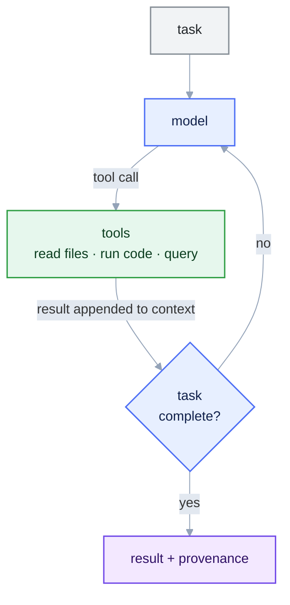
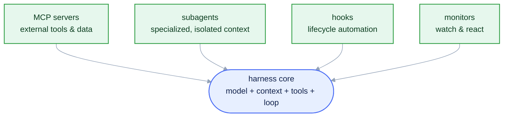
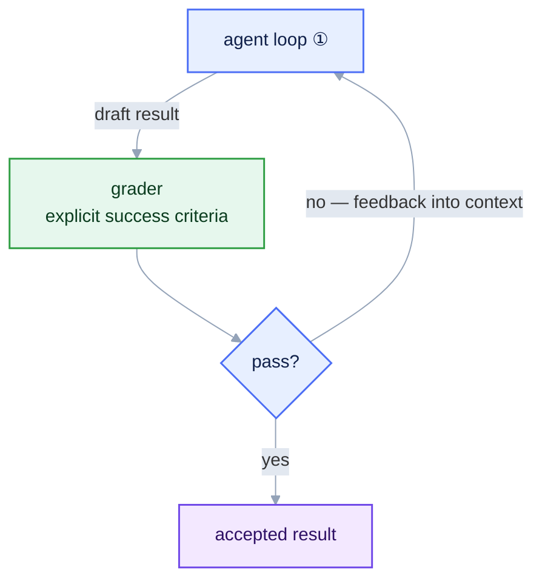
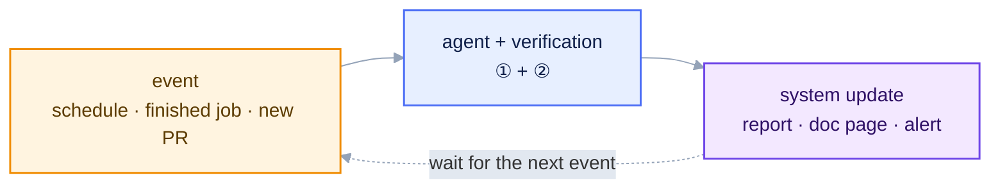

::::::::::::::::::::::::::::::::::::::::::::: questions

- How does an agentic assistant differ from a chat model?
- What are the parts of an LLM "harness"?
- What loops sit around the agent loop, and what does each add?
- How do we get trustworthy results from a stochastic model?
- Why build on an open protocol, not one product?

:::::::::::::::::::::::::::::::::::::::::::::

::::::::::::::::::::::::::::::::::::::::::::: objectives

- Trace one pass of the agent loop for a physics task, naming what enters the context at each step.
- Draft acceptance criteria precise enough that a grader — human or agent — can apply them.
- Place a given automation (a format-on-edit hook, a nightly report, a prompt tweak) at the right loop level.
- Choose between a tool, a skill, and a subagent when adding a new capability.

:::::::::::::::::::::::::::::::::::::::::::::

## The bottleneck is rarely the physics

In a typical analysis the physics steps are few: select a final state, build an observable, fit a
signal. Most of the time goes into the software around them: finding datasets, learning the data
model, getting branch names and units right, and iterating on plotting and analysis code. LLMs can
reduce this work, but only if their results can be checked. Later episodes apply this to the decay
$\Lambda^0 \to p\,\pi^-$.

## Two modes of use

A **chat completion** is a single request: a prompt goes in, text comes out. If the text is code,
you run it, read the error, and paste it back by hand. The model never observes your
data or the result of running anything.

An **agentic loop** runs the same model inside a control structure that lets it act. The model
proposes an action, an external **tool** carries it out, the result is added to the context, and
the model is called again, until a stopping condition is met. The model then works from the actual
state of your files and the output of real computations, not only from its training.

::::::::::::::::::::::::::::::::::::::::::::: callout

## Scope

Here, "generative AI" means an LLM-based coding assistant used in this agentic mode. Machine
learning for reconstruction or particle identification is not covered. The subject is writing and
running analyses.

:::::::::::::::::::::::::::::::::::::::::::::

This loop is the first of four. Each one wraps the one before it, and this episode goes through
them in order.

## Level 1 — the agent loop

The basic cycle: the model calls a tool, looks at what came back, and decides
whether it is done.

The model together with the software that runs this cycle is called a **harness**. It has four parts:

* **Model**: reasoning and code generation. The provider and model can be swapped; they are not
  part of the method.
* **Context**: everything the model sees in a step: instructions, files, earlier turns, tool
  outputs. Its size is limited (the *context window*).
* **Tools**: operations the model may call. Tools are the only way the model can change anything
  outside itself.
* **Control loop**: repeats *propose → execute → observe* until the task is done. This is what
  separates an agent from a chatbot.

### Extending the harness

Current assistants add a few standard extension points to this core.

* **MCP servers**: tools in a standard form that works with any assistant. This is how the
  assistant gets physics tools ([Episode 3](03-mcp-servers.md)).
* **Subagents**: separate assistants started for a sub-task, so a large task can be split up.
* **Skills**: versioned *procedures* (a `SKILL.md` plus scripts) loaded when a request matches
  ([Episode 4](04-skills.md)). A tool is a capability; a skill is a recipe.

* **Hooks**: scripts the harness runs at fixed moments, e.g. reformat code after every edit or log
  each tool call.
* **Monitors**: watch background work, e.g. a long batch job, and call the assistant again when it
  finishes.

## Level 2 — the verification loop

A level-1 agent stops when it decides the task is complete. An LLM is stochastic: the same prompt
can give different outputs, and a confident answer is not evidence of a correct one. A second loop
around the first handles this. A **grader** checks the agent's result against explicit acceptance
criteria, and a failure goes back to the agent as feedback for another attempt.

Treat every model output as a **hypothesis** and accept it only after checking it against something
external: the data, a fit statistic, a known physical value, or an independent implementation. For the $\Lambda^0$ measurement the criteria are physical and
checkable: $|\mu - 1.115683\,\mathrm{GeV}| < 5\,\mathrm{MeV}$, $\sigma$ consistent with detector
resolution, $\chi^2/\mathrm{ndf}$ of order 1. In [Episode 4](04-skills.md) you write this grader into the
lambda-fit skill's **success criteria**. An agent that passes reports the numbers; one that fails
must report the failure instead of a result.

Grading costs time and tokens, but in physics analysis correctness matters more than speed. Prefer
tools that return small quantities you can inspect (counts, bin edges, fit parameters), and keep a
record of what was run.

## Level 3 — the operation loop

With verification in place, the agent no longer needs you to start it. In a third loop an event
(a schedule, a finished production job, a new pull request) starts the agent, its verified output updates something (a report, a documentation page, an alert), and the
system goes back to waiting.

[Episode 6](06-eic-mcp-servers.md) shows collaboration examples: documentation regenerated on a
schedule, and reviews triggered per pull request.

## Level 4 — the improvement loop

The last loop goes around everything. From time to time, look at what the agent actually did
(transcripts, failed fits, wrong tool choices) and change the **harness** accordingly: clarify
`AGENTS.md`, tighten a skill's success criteria, add a missing tool. You do a small version of this
whenever a prompt goes wrong and you fix the instructions instead of retyping the request.

::::::::::::::::::::::::::::::::::::::::::::: callout

## Where a human belongs in each loop

Each level has a point where a person should decide: approving a sensitive tool call (1), signing
off a graded result (2), reviewing what runs unattended (3), and choosing which harness changes to
keep (4).

:::::::::::::::::::::::::::::::::::::::::::::

The [next episode](02-your-ai-coding-setup.md) describes the physics measurement.

::::::::::::::::::::::::::::::::::::::::::::: keypoints

- An agentic assistant runs tools and reads their output; a chat model only returns text.
- Treat every result as a hypothesis and check it against clear criteria before you accept it.

:::::::::::::::::::::::::::::::::::::::::::::

<small>The four-level loop schematics are adapted from
[*The Art of Loop Engineering*](https://www.langchain.com/blog/the-art-of-loop-engineering).</small>
