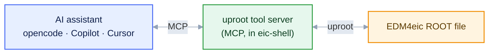
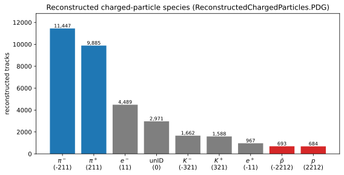

<style>
/* Mermaid: force diagram label text dark so it stays readable on the
   light node fills in BOTH light and dark mode. The Carpentries dark
   theme sets `p`/`li` color and darkens `pre` backgrounds, which would
   otherwise turn mermaid's label text light (invisible on light nodes)
   and the diagram surface dark. We override both, with !important to
   beat the theme rules and mermaid's own inline styles. */
.mermaid { background: transparent !important; }
/* Hide the Workbench "Diagram source code" spoiler under each diagram */
.mermaid-img-wrapper details { display: none !important; }
.mermaid .nodeLabel, .mermaid .edgeLabel, .mermaid .label,
.mermaid .cluster-label, .mermaid text, .mermaid tspan,
.mermaid span, .mermaid p, .mermaid foreignObject div {
  color: #10204a !important;
  fill: #10204a !important;
}
.mermaid .edgeLabel, .mermaid .edgeLabel p, .mermaid .edgeLabel rect {
  background-color: #e2e8f0 !important;
}
/* AI prompts: paste-into-your-assistant blocks. Styled like a normal
   code block (same neutral pre background/border as python etc.), with
   just a small "AI Prompt" tag in the corner. */
pre.ai-prompt, div.sourceCode.ai-prompt {
  border-top: 10px solid #7c3aed;
}
pre.ai-prompt, pre.ai-prompt code {
  white-space: pre-wrap;       /* wrap long prompts onto many lines */
  overflow-wrap: anywhere;
}
pre.ai-prompt::before, div.sourceCode.ai-prompt::before {
  content: "AI Prompt";
  display: block;
  margin-bottom: .5rem;
  font-weight: 600;
  font-size: .78em;
  letter-spacing: .03em;
  text-transform: uppercase;
  color: #7c3aed;
}
</style>

::::::::::::::::::::::::::::::::::::::::::::: questions

- What is MCP, and what problem does it solve?
- What can the EIC tool servers do?
- How do you connect an assistant to them?

:::::::::::::::::::::::::::::::::::::::::::::

::::::::::::::::::::::::::::::::::::::::::::: objectives

- Start the servers, check them, and read a server log when something fails (`eic-mcp up`/`status`/`logs`).
- Generate the connection file for your own client with `eic-mcp config`.
- Discover a real DIS dataset by prompting, without hard-coding names or paths.
- Judge which returned quantities are worth verifying, and against what.

:::::::::::::::::::::::::::::::::::::::::::::

## One interface for tools

Tools are the only way an assistant can act ([Episode 1](01-why-genai-for-physics.md)). The
**Model Context Protocol (MCP)** defines a standard interface for them: write a tool once as a
**server**, and any **client** (assistant) that supports MCP can use it.

The lesson's servers run inside eic-shell, and the assistant talks to them over a local web
address.



## The uproot tool server

The ePIC [uproot tool server](https://github.com/eic/uproot-mcp-server) reads ROOT/EDM4eic files
with [uproot](../learners/reference.md). It can list a file's contents, compute statistics and
histograms, and run short NumPy calculations over one file or a whole dataset. It returns small
summaries (counts, bin edges, statistics) that you can check, not raw data. The calculations run
in a sandbox that cannot install software or write files.

## Start the servers

Start the servers inside eic-shell (see [Setup](../learners/setup.md)):

```bash
$ eic-mcp up
```

This starts the uproot, xrootd, and rucio servers. `eic-mcp status` shows which are running, and
`eic-mcp logs uproot` shows a server's log.

::::::::::::::: callout

## If rucio answers but xrootd/uproot time out

If dataset queries work but file access hangs, the XRootD store may be down; check with
`xrdfs root://epicxrd1.sdcc.bnl.gov:1095 ls /eic/EPIC/RECO`.

The default store (BNL) has campaigns from 25.12.0. For older ones (up to 25.10.x) use JLab:
`XROOTD_SERVER=root://dtn2304.jlab.org:8443 XROOTD_BASE_DIR=/jlab-osdf-ro/eic/EPIC/volatile eic-mcp restart`.

If every uproot call times out after one large call, the server is busy, not broken: it handles
one request at a time. Wait, or run `EIC_MCP_SERVERS=uproot eic-mcp restart`.

:::::::::::::::

## Connect the assistant

Write opencode's config file in the directory where you start opencode, then start it:

```bash
$ eic-mcp config opencode
$ opencode
```

In the session, `/mcp` lists the connected servers and their tools.

Other clients use the same URLs: `eic-mcp config claude` (or `copilot`, `vscode`, `cursor`,
`gemini`, `codex`) writes the file where that client reads it.

## Finding the data with MCP

You do not download a dataset. The other two MCP servers let the assistant find and verify the
files, in place of running `rucio` and `xrdfs` by hand, and `uproot-mcp` then reads them directly
from the store.


* **[`rucio-mcp`](https://github.com/eic/rucio-eic-mcp-server)** searches the data catalog: it
  finds a dataset by name, lists its files, and gives their `root://` locations.
* **[`xrootd-mcp`](https://github.com/eic/xrootd-mcp-server)** browses the data store and checks
  that the files exist.

`uproot-mcp` then reads a `root://` file **in place**.

## List the available campaigns

ePIC data is organized by **production campaign**, a version such as `26.06.0`. The campaign, the
beam/target, and the physics process are all part of the rucio DID
(e.g. `epic:/RECO/26.06.0/epic_craterlake/DIS/pythia8.316-1.0/NC/noRad/ep/18x275/...`). Before
locating a specific dataset, check which campaigns exist so you use a current one:

```{.ai-prompt}
Using the rucio tools, find which production campaigns are available (the version field in the DIDs, e.g. 26.06.0) and show the most recent few.
```

Watch how the assistant does this: the catalog holds thousands of datasets in no particular
order, so looking at only the first page of results can miss the newest campaigns.

::::::::::::::::::::::::::::::::::::::::::::: challenge

## Exercise: locate a dataset (≈ 10 min)

Ask your assistant:

```{.ai-prompt}
Use the rucio tools to find the ePIC reconstructed-DIS dataset for the BeAGLE eCu ep 10x115 GeV sample in campaign 26.04.1, list its files, then use the xrootd tools to confirm those files exist on the store and report the total number of events.
```

::::::::::::::: solution

The assistant finds the dataset with rucio (374 files), gets their `root://` locations, and checks
them with xrootd. rucio does not store event counts, and reading all 374 files would take an hour,
so a good answer checks a few files (≈ 1,220 events each) and extrapolates.

:::::::::::::::

:::::::::::::::::::::::::::::::::::::::::::::

## Inspect the dataset

You describe what you want in plain language and the assistant makes the tool calls. Take one of
the `root://` URLs from the previous exercise (written below as
`root://epicxrd1.sdcc.bnl.gov:1095//…`) and analyze it in place.

::::::::::::::::::::::::::::::::::::::::::::: challenge

## Exercise: enumerate the schema (≈ 10 min)

Issue the request:

```{.ai-prompt}
Using the uproot tools, report the structure of the events tree in root://epicxrd1.sdcc.bnl.gov:1095//<your-discovered-file>.root and list the members of the ReconstructedChargedParticles collection.
```

::::::::::::::: solution

The assistant reads the structure of the `events` tree and reports something like:

```output
File:  root://epicxrd1.sdcc.bnl.gov:1095//…/<dataset-file>.root
Tree:  events   — branches grouped by collection

ReconstructedChargedParticles collection:
  ReconstructedChargedParticles.PDG          int32[]   PDG particle-ID code
  ReconstructedChargedParticles.momentum.x   float[]   p_x [GeV]
  ReconstructedChargedParticles.momentum.y   float[]   p_y [GeV]
  ReconstructedChargedParticles.momentum.z   float[]   p_z [GeV]
  … energy, charge, mass, type, referencePoint.*, covMatrix.*
```

The names are read from the file, not guessed, so the assistant cannot invent branch names.

:::::::::::::::

:::::::::::::::::::::::::::::::::::::::::::::

::::::::::::::::::::::::::::::::::::::::::::: challenge

## Exercise: identify the species present (≈ 10 min)

Issue the request:

```{.ai-prompt}
Histogram ReconstructedChargedParticles.PDG with one bin per integer code, so I can see the reconstructed particle species in the file.
```

::::::::::::::: solution

The assistant makes a histogram with one bin per PDG code. A reconstructed-DIS file gives, for
example:

```output
   PDG  species   count
  -211   pi-      11447
   211   pi+       9885
    11   e-        4489
     0   unID      2971      <- tracks with no PID hypothesis
  -321   K-        1662
   321   K+        1588
   -11   e+         967
 -2212   pbar       693
  2212   p          684      <- protons are rare
```

{alt='Bar histogram of reconstructed charged-particle PDG codes in the file, with pions dominating and protons rare'}

Pions dominate; **protons are rare** (≈ 2%), so the Λ⁰ signal will be small. A sizeable fraction of
tracks have **no PID** (code 0) or a wrong one. This misidentification adds to the combinatorial
background, which is why we fit the peak instead of counting it.

:::::::::::::::

:::::::::::::::::::::::::::::::::::::::::::::

::::::::::::::::::::::::::::::::::::::::::::: callout

## Verify the returned quantities

Look at the returned numbers (bin edges, counts, statistics). Do the PDG peaks fall at physical
codes, and are the proton and pion yields plausible? [Episode 4](04-skills.md) turns this into
explicit success criteria.

:::::::::::::::::::::::::::::::::::::::::::::

The same Λ⁰ peak can be obtained without MCP, with ROOT RDataFrame, TTreeReader, plain uproot, or
the PODIO Frame API; scripts are in [`extras/`](https://github.com/eic/tutorial-mcp/tree/main/extras).

The assistant can now query the data through tools whose output you can check. The next episode
writes this procedure down as a reusable, versioned **skill**.

::::::::::::::::::::::::::::::::::::::::::::: keypoints

- MCP servers give an assistant tools; any MCP assistant can use them.
- `eic-mcp up` starts the servers in eic-shell and `eic-mcp config opencode` connects opencode.

:::::::::::::::::::::::::::::::::::::::::::::
