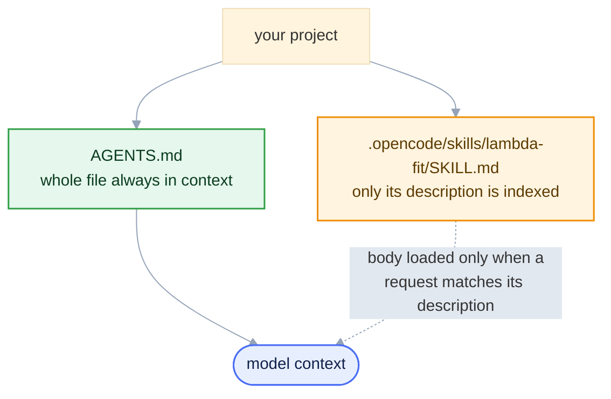

<style>
/* Mermaid: force diagram label text dark so it stays readable on the
   light node fills in BOTH light and dark mode. The Carpentries dark
   theme sets `p`/`li` color and darkens `pre` backgrounds, which would
   otherwise turn mermaid's label text light (invisible on light nodes)
   and the diagram surface dark. We override both, with !important to
   beat the theme rules and mermaid's own inline styles. */
.mermaid { background: transparent !important; }
/* Hide the Workbench "Diagram source code" spoiler under each diagram */
.mermaid-img-wrapper details { display: none !important; }
.mermaid .nodeLabel, .mermaid .edgeLabel, .mermaid .label,
.mermaid .cluster-label, .mermaid text, .mermaid tspan,
.mermaid span, .mermaid p, .mermaid foreignObject div {
  color: #10204a !important;
  fill: #10204a !important;
}
.mermaid .edgeLabel, .mermaid .edgeLabel p, .mermaid .edgeLabel rect {
  background-color: #e2e8f0 !important;
}
/* AI prompts: paste-into-your-assistant blocks. Styled like a normal
   code block (same neutral pre background/border as python etc.), with
   just a small "AI Prompt" tag in the corner. */
pre.ai-prompt, div.sourceCode.ai-prompt {
  border-top: 10px solid #7c3aed;
}
pre.ai-prompt, pre.ai-prompt code {
  white-space: pre-wrap;       /* wrap long prompts onto many lines */
  overflow-wrap: anywhere;
}
pre.ai-prompt::before, div.sourceCode.ai-prompt::before {
  content: "AI Prompt";
  display: block;
  margin-bottom: .5rem;
  font-weight: 600;
  font-size: .78em;
  letter-spacing: .03em;
  text-transform: uppercase;
  color: #7c3aed;
}
</style>

::::::::::::::::::::::::::::::::::::::::::::: questions

- How do you give an assistant durable project context?
- AGENTS.md or SKILL.md: when to use each?
- How do you make every tool read the same rules?
- What's in a usable SKILL.md for the Λ⁰ fit?

:::::::::::::::::::::::::::::::::::::::::::::

::::::::::::::::::::::::::::::::::::::::::::: objectives

- Write an AGENTS.md for always-on project context.
- Bridge it so one AGENTS.md drives any tool.
- Write a SKILL.md that runs the Λ⁰ fit on demand.
- Encode success criteria + provenance for auditable output.

:::::::::::::::::::::::::::::::::::::::::::::

## Two ways to make instructions persistent

Typed requests (Episode 3) have to repeat the data model, conventions, and procedure every session, and two runs can differ. Two kinds of file solve this.

* **`AGENTS.md`**: **context** read at the start of every session: environment, data model, conventions, and what "done" means.
* **`SKILL.md`**: a **procedure** in a named skill directory, loaded only when a request matches its description. It describes one repeatable workflow.



`AGENTS.md` answers "what is this project and how do we work here?"; a `SKILL.md` answers "how do I carry out *this* task?".

## AGENTS.md: project context

`AGENTS.md` is plain Markdown at your project root (subdirectories may override it for files beneath them). opencode, Codex, Gemini CLI, Zed, and others read it automatically; a tool that looks for a different filename reads the same content through a one-line bridge (next section).

It is loaded on every turn, so keep it short and factual:

```markdown
# AGENTS.md — Lambda analysis project

## What this project does
Reconstruct Lambda0 -> p pi- in ePIC EDM4eic data and fit the invariant-mass
peak near 1.115683 GeV.

## Environment
- Everything runs inside eic-shell; the MCP servers are started with `eic-mcp up`.
- Data lives on the grid: find a DIS dataset with the `rucio` tools and read its
  root:// files in place with `uproot`. Do not download.

## Tools
- Use the `rucio` MCP server (list_dids, list_files, list_file_replicas) to locate
  a dataset and resolve its root:// URLs.
- Use the `xrootd` MCP server (check_file_exists, get_file_info) to verify a file.
- Use the `uproot` MCP server (get_tree_info, histogram_branch, execute_kernel,
  execute_kernel_dataset) for all ROOT file access. Prefer get_tree_info over
  get_file_structure: on an EDM4eic file the latter returns megabytes.
- Do NOT write bespoke file I/O; the servers already handle it.

## When a tool fails

- Never install software (no `pip install`, above all not `--break-system-packages`)
  and never re-implement the analysis with local uproot/ROOT.
- A timed-out call means the server is BUSY, not broken: it is single-threaded and
  still working on the previous request. Wait, retry once, and if it still fails,
  stop and report which tool failed with which arguments.
- Never reuse a cached earlier tool result as if it were fresh. A number that did
  not come from the MCP servers is not reproducible, so it is not an answer.

## Data model
- Tree: events.  Collection: ReconstructedChargedParticles.
- Members: .PDG, .momentum.x, .momentum.y, .momentum.z   (momenta in GeV).
- PDG codes: proton 2212, pi- -211, antiproton -2212, pi+ 211.

## Physics constants (PDG)
- m(proton) = 0.9382720813 GeV, m(pi) = 0.13957061 GeV, m(Lambda) = 1.115683 GeV.

## Conventions
- Invariant mass over [1.05, 1.25] GeV, 200 bins.
- Fit a Gaussian + 2nd-order polynomial over [1.08, 1.16] GeV.
- Write results as JSON; save plots under output/.

## Definition of done
- Fitted peak within a few MeV of 1.115683 GeV and chi2/ndf of order 1.
- Always run the fit and check these before reporting a result.
```

It records the schema, the tool policy (use the server, not hand-written I/O), the conventions, and a definition of done.

::::::::::::::::::::::::::::::::::::::::::::: callout

## Two rules for a useful AGENTS.md

* **Keep it short.** It is loaded on every turn, so every line costs tokens. Write only what the model cannot infer from the code.
* **Describe concepts, not file paths.** "The reconstructed tracks are in the `ReconstructedChargedParticles` collection" stays true; a path like `src/old/lambda_v2.py` goes stale, and the model then searches in the wrong place.

:::::::::::::::::::::::::::::::::::::::::::::

## One source of truth: bridge files

opencode, Codex, Gemini CLI, and Zed read `AGENTS.md`. Some tools read only their own file: GitHub Copilot reads `copilot-instructions.md`, Cursor reads `.cursorrules`. Without it they run with no context and no warning.

Do not copy your rules into a second file; the copies will diverge. Make the tool-specific file a one-line *bridge* to `AGENTS.md`. `.github/copilot-instructions.md` (Copilot) and `.cursorrules` (Cursor) contain:

```markdown
Follow the project rules in AGENTS.md.
```

The bridge file is in the repository: [`copilot-instructions.md`](https://github.com/eic/tutorial-mcp/blob/main/files/skills/copilot-instructions.md).

## SKILL.md — a named procedure

A **skill** is a directory containing a `SKILL.md` that describes a repeatable procedure:

```bash
skills/
  lambda-fit/
    SKILL.md              specification: applicability, inputs, steps, success criteria
```

The procedure only uses the MCP tools, so it needs no scripts of its own.

The YAML frontmatter has a `name` and a `description`. The client matches your request against the `description` to decide whether to load the skill. **Only the name and description stay in context**; the body is read only when the description matches.

```markdown
---
name: lambda-fit
description: >
  Reconstruct and fit the Lambda0 -> p pi- invariant-mass peak in ePIC EDM4eic
  data. Use when asked to measure the Lambda yield, mass, or width, or to
  reproduce the Lambda peak from a .root file or a file list.
---

# Lambda invariant-mass fit

## When to use
Any request to find, fit, or quantify the Lambda0 (or its antiparticle) in ePIC
reconstructed data via the proton-pion invariant mass.

## Inputs
- file: one EDM4eic .root URL (a root:// file from a DIS dataset), or
- file_list: the dataset's root:// files for the full sample
  (resolve both with the rucio tools: list_dids, list_files, list_file_replicas).

## Steps
1. Confirm the uproot MCP server is connected: get_tree_info on the input.
2. Build the proton-pion invariant-mass histogram with execute_kernel (one file)
   or execute_kernel_dataset (many files), tree_name 'events' and the
   ReconstructedChargedParticles momentum/PDG branches. For a large sample, cap
   the file count first; for more than ~10 files use submit_kernel_dataset and
   poll, in batches of ~20 files per job (one big job can hit an upstream idle
   timeout), so no single tool call outlives the client's timeout. Write any
   reduce/merge code as plain NumPy array operations (the sandbox rejects tuple
   unpacking in loops).
3. Fit the histogram with a second execute_kernel call (Gaussian + 2nd-order
   polynomial over [1.08, 1.16] GeV; NumPy/awkward only, no imports).
4. Report mu, sigma, signal yield S, and chi2/ndf.

## Success criteria (check before reporting success)
- At least ~50 entries in the fit window. With fewer, report insufficient
  statistics and stop — a low-stats fit lets the polynomial absorb the peak and
  can pass the checks below by accident.
- |mu - 1.115683 GeV| < 0.005 GeV.
- sigma in ~[0.001, 0.005] GeV (this is detector resolution, not natural width).
- chi2/ndf of order 1.
If any check fails, report the failure and the fit diagnostics, not a result.

## Provenance
List the tool calls and their parameters, and the dataset used (campaign and
file list), so the run can be reproduced.
```

::::::::::::::::::::::::::::::::::::::::::::: callout

## How clients load a skill

opencode reads skills from `.opencode/skills/<name>/SKILL.md` in the project directory (or
`~/.config/opencode/skills/` for all projects); Claude Code uses `.claude/skills/`. Download
the lesson's copy:

```bash
curl -fsSL --create-dirs -o .opencode/skills/lambda-fit/SKILL.md \
  https://raw.githubusercontent.com/eic/tutorial-mcp/main/files/skills/lambda-fit/SKILL.md
```

Loading is the model's decision, based on the skill's `description`. A small model may answer
without loading it, so every prompt in this lesson names the skill: "Using the lambda-fit skill".
Clients without a skill mechanism can reference the procedure from `AGENTS.md` instead.

:::::::::::::::::::::::::::::::::::::::::::::

Get both example files in place: [`files/skills/AGENTS.md`](https://github.com/eic/tutorial-mcp/blob/main/files/skills/AGENTS.md) (download it to your analysis directory) and [`files/skills/lambda-fit/SKILL.md`](https://github.com/eic/tutorial-mcp/blob/main/files/skills/lambda-fit/SKILL.md) (download it as above).

## Your project layout

A project that behaves the same under any assistant:

```bash
lambda-analysis/
├── AGENTS.md                        # source of truth: context + conventions (write this)
├── .github/
│   └── copilot-instructions.md      # points to AGENTS.md   (bridge for Copilot)
├── .cursorrules                     # points to AGENTS.md   (bridge for Cursor)
├── opencode.jsonc                   # MCP server connections: `eic-mcp config opencode` (Episode 3)
└── .opencode/
    └── skills/
        └── lambda-fit/              # downloaded from the lesson (see callout above;
            └── SKILL.md             #  `.claude/skills/` for Claude Code)
```

::::::::::::::::::::::::::::::::::::::::::::: challenge

## Exercise: a summary skill (≈ 10 min)

Write a minimal `SKILL.md` for "summarize the contents of any EDM4eic file", place it where your
client loads skills, and try it on a file from Episode 3.

::::::::::::::: solution

```markdown
---
name: edm4eic-summary
description: >
  Summarize the contents of an EDM4eic .root file. Use when asked what a
  reconstruction file contains, which trees or collections it holds, or
  how many events it has.
---

# EDM4eic file summary

## Steps
1. get_tree_info on the `events` tree: entry count and collection names.
   (Skip get_file_structure — on EDM4eic files it returns megabytes.)
2. get_tree_info on `runs` and `podio_metadata` for provenance.
3. Return a compact summary: each tree with its entry count, and the
   top-level collections grouped by kind (truth, tracking, calorimetry,
   PID, reconstructed).

## Success criteria
Every tree named with its entry count; if a tree is missing, say so
rather than guessing.
```

Save it as `.opencode/skills/edm4eic-summary/SKILL.md` and name it in the prompt
("Using the edm4eic-summary skill, …"); a small model may not load it from the description alone.

:::::::::::::::

:::::::::::::::::::::::::::::::::::::::::::::

::::::::::::::::::::::::::::::::::::::::::::: challenge

## Exercise: richer provenance (≈ 5 min)

Extend the provenance section of `lambda-fit` so a run also records the number of input files and
the total number of candidate pairs.

::::::::::::::: solution

Replace the skill's Provenance section with:

```markdown
## Provenance
List the tool calls and their parameters, the dataset used (campaign and
file list), the number of input files processed, and the total number of
proton-pion candidate pairs entering the histogram, so the run can be
reproduced.
```

The kernel can return the pair count next to the histogram
(e.g. `{"counts": ..., "n_pairs": int(len(m))}`) and sum it over files.

:::::::::::::::

:::::::::::::::::::::::::::::::::::::::::::::

The [next episode](05-end-to-end-agents.md) runs this skill end to end and scales it from one file to the full sample.

::::::::::::::::::::::::::::::::::::::::::::: keypoints

- `AGENTS.md` holds project context; a `SKILL.md` holds a procedure the assistant loads when needed.
- Put success criteria in the skill so you can check the result.

:::::::::::::::::::::::::::::::::::::::::::::
