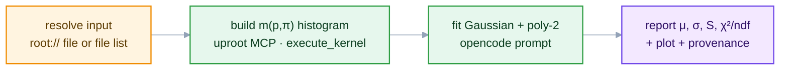
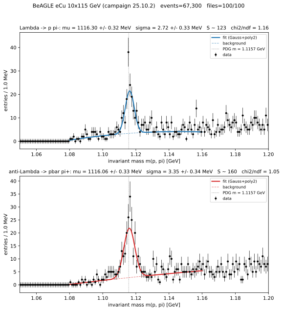

<style>
/* Mermaid: force diagram label text dark so it stays readable on the
   light node fills in BOTH light and dark mode. The Carpentries dark
   theme sets `p`/`li` color and darkens `pre` backgrounds, which would
   otherwise turn mermaid's label text light (invisible on light nodes)
   and the diagram surface dark. We override both, with !important to
   beat the theme rules and mermaid's own inline styles. */
.mermaid { background: transparent !important; }
/* Hide the Workbench "Diagram source code" spoiler under each diagram */
.mermaid-img-wrapper details { display: none !important; }
.mermaid .nodeLabel, .mermaid .edgeLabel, .mermaid .label,
.mermaid .cluster-label, .mermaid text, .mermaid tspan,
.mermaid span, .mermaid p, .mermaid foreignObject div {
  color: #10204a !important;
  fill: #10204a !important;
}
.mermaid .edgeLabel, .mermaid .edgeLabel p, .mermaid .edgeLabel rect {
  background-color: #e2e8f0 !important;
}
/* AI prompts: paste-into-your-assistant blocks. Styled like a normal
   code block (same neutral pre background/border as python etc.), with
   just a small "AI Prompt" tag in the corner. */
pre.ai-prompt, div.sourceCode.ai-prompt {
  border-top: 10px solid #7c3aed;
}
pre.ai-prompt, pre.ai-prompt code {
  white-space: pre-wrap;       /* wrap long prompts onto many lines */
  overflow-wrap: anywhere;
}
pre.ai-prompt::before, div.sourceCode.ai-prompt::before {
  content: "AI Prompt";
  display: block;
  margin-bottom: .5rem;
  font-weight: 600;
  font-size: .78em;
  letter-spacing: .03em;
  text-transform: uppercase;
  color: #7c3aed;
}
</style>

::::::::::::::::::::::::::::::::::::::::::::: questions

- How do assistant + server + skill compose into one analysis?
- How does the kernel scale from one file to the full sample?
- How is the yield extracted and made reproducible?

:::::::::::::::::::::::::::::::::::::::::::::

::::::::::::::::::::::::::::::::::::::::::::: objectives

- Set up any MCP client for the end-to-end run in three steps.
- Pick the right kernel tool for the sample size (`execute_kernel` vs `execute_kernel_dataset`).
- Sign off — or reject — an agent-produced yield using the audit checklist.

:::::::::::::::::::::::::::::::::::::::::::::

## Run it in your client

Everything below runs from the same three-step setup, whatever assistant you use:

1. Inside eic-shell, start the servers: `eic-mcp up`.
2. In your analysis directory, connect your client and put the Episode 4 files in place:

   ```bash
   eic-mcp config opencode > opencode.jsonc
   cp ~/tutorial-mcp/files/skills/AGENTS.md .
   mkdir -p .opencode/skills
   ln -s ~/tutorial-mcp/files/skills/lambda-fit .opencode/skills/lambda-fit
   ```

3. Launch `opencode`, check `/mcp` lists `uproot`, `xrootd`, and `rucio`, and paste the pipeline
   prompt below.

::::::::::::::: callout

## Same pipeline, other clients

Only step 2 changes: `eic-mcp config <client>` writes the file each client expects — e.g.
`eic-mcp config claude > .mcp.json` for Claude Code (preinstalled in eic-shell). The full list is
in [Episode 3](03-mcp-servers.md). The servers and prompts are identical; put the skill where your
client reads skills (`.claude/skills/` for Claude Code).

:::::::::::::::

## The composed pipeline

The previous episodes combine into one procedure run from a single request: the lambda-fit skill (Episode 4) supplies the steps, the [uproot tool server](https://github.com/eic/uproot-mcp-server) (Episode 3) supplies verifiable data access, and the agentic loop (Episode 1) carries it out and checks the result.



## One file, end to end

With the three servers running and the lambda-fit skill available, one request runs the whole chain. Point it at one of the dataset's `root://` files. The assistant uses `rucio` tools to find a DIS dataset and `list_file_replicas` for the URLs, `xrootd` to confirm the file is there, then reads it in place:

```{.ai-prompt}
Using the lambda-fit skill, measure the Lambda0 peak in this file:
root://epicxrd1.sdcc.bnl.gov:1095//... (one of the dataset's root:// files).
Build the proton-pion invariant-mass histogram with the uproot MCP server (tree 'events'),
fit it, and report mu, sigma, the yield, and chi2/ndf, with the plot — or report insufficient
statistics if the fit window is too sparse.
```

The assistant calls `execute_kernel` (tree `events`, proton/pion branches) to build the histogram, then a follow-up prompt fits it with a Gaussian-plus-polynomial model. One file yields only ~8 candidates in the fit window, so the honest answer is *insufficient statistics* — the skill says stop rather than fit, and a model that quotes $\mu$ anyway has ignored it. The peak at $\mu \approx 1.1157$ GeV comes from the larger sample below.

::::::::::::::::::::::::::::::::::::::::::::: callout

## Smaller models take shortcuts — verify the result, not the route

A capable model uses `execute_kernel` as instructed. A cheaper model may reach for `execute_kernel_dataset` on a single file, or write its own NumPy in the kernel — both produce the same histogram. The audit checklist below judges the *result* (peak position, width, $\chi^2/\text{ndf}$, recorded inputs), not which tool produced it.

:::::::::::::::::::::::::::::::::::::::::::::

## Scaling to the full sample

The same kernel works unchanged on many files; only the tool differs. `execute_kernel` runs one file; `execute_kernel_dataset` runs the identical kernel over a whole file list and returns one merged histogram, so peak memory does not grow with dataset size. Enumerate the files with `get_dataset_file_list`, then run it across them:

```{.ai-prompt}
Using the lambda-fit skill, run the same proton-pion mass kernel across the first 8 of the dataset's files
with execute_kernel_dataset (tree 'events'), merge the histograms, then fit the result and
report mu, sigma, the yield, and chi2/ndf for both Lambda and anti-Lambda, with the plot.
```

The kernel sandbox is NumPy/awkward only (no imports, no I/O), so the assistant returns the merged histogram and runs a follow-up fit prompt. One practical limit: a synchronous `execute_kernel_dataset` call over ~8 files already takes about a minute — right where many clients cut a tool call off. For anything bigger, go async: `submit_kernel_dataset`, then poll `get_job_status`/`get_job_result`. Over ~100 files this gives the reference spectrum below: a clear Λ⁰ (and Λ̄) peak over the combinatorial background.

{alt='Proton–pion invariant-mass spectrum with Gaussian-plus-polynomial fits showing clear Lambda and anti-Lambda peaks near 1.1157 GeV'}

```output
Lambda      -> p pi-:   mu = 1116.30 +/- 0.32 MeV   sigma = 2.72 +/- 0.33 MeV   S = 123   chi2/ndf = 1.16
anti-Lambda -> pbar pi+: mu = 1116.06 +/- 0.33 MeV   sigma = 3.35 +/- 0.34 MeV   S = 160   chi2/ndf = 1.05
```

The fitted $\mu$ sits ~0.6 MeV above the PDG value (1.115683 GeV), a calibration-level offset typical of reconstructed momenta; $\sigma$ is the detector mass resolution, not the (negligible) Λ⁰ natural width.

## Extracting the yield

The fit model is a Gaussian signal on a second-order polynomial background over $[1.08, 1.16]$ GeV:

$$
f(m) = A \exp\!\left[ -\tfrac{1}{2} (m - \mu)^2 / \sigma^2 \right] + \left( c_0 + c_1 (m - m_\Lambda) + c_2 (m - m_\Lambda)^2 \right)
$$

The polynomial absorbs the combinatorial background (Episode 2); the integrated signal is $S = A\sqrt{2\pi}\,\sigma / (\text{bin width})$. Report $S$ with its uncertainty alongside $\mu$, $\sigma$, and $\chi^2/\text{ndf}$ — a bare bin count mixes signal with background.

## Reproducibility and audit

Before treating an automated result as final, confirm it meets the skill's criteria:

::::::::::::::::::::::::::::::::::::::::::::: callout

## Audit checklist

* **Signal.** $\mu$ within a few MeV of 1.115683 GeV; $\sigma$ consistent with detector resolution; $\chi^2/\text{ndf}$ of order unity; $S$ reported with an uncertainty.
* **Inputs pinned.** Dataset (campaign and file list), particle masses, mass window, binning, and fit range all fixed and recorded.
* **Provenance.** Tool calls and their arguments logged, so the run can be reconstructed.
* **Cost bounded.** File count capped during development before scaling up with `execute_kernel_dataset`.
* **Oversight.** A human inspected the fit before the result was reported.

:::::::::::::::::::::::::::::::::::::::::::::

## Exercises (specification)

* Run the single-file chain through your assistant and report $\mu$, $\sigma$, $S$, and $\chi^2/\text{ndf}$.
* Process 8 files with `execute_kernel_dataset` and compare the fitted parameters to the ~100-file result; comment on the change in statistical uncertainty. (More than that, and the synchronous call outlives your client's tool timeout — go async with `submit_kernel_dataset`.)
* Complete the audit checklist for your run, attaching the recorded tool calls as provenance.

::::::::::::::::::::::::::::::::::::::::::::: callout

## Try a different beam

Nothing here is tied to the eCu sample — point the skill at any reconstructed-DIS DID and the
same prompt works. Nuclear beams (eCu, eAu) give the most Λ per event; plain ep samples need a
few times more files for the same peak, but have thousands to spare. Find the DIDs with
`list_dids` as in Episode 3.

:::::::::::::::::::::::::::::::::::::::::::::

You now have the complete workflow: a free assistant, portable tool servers, a versioned skill, and a reproducible Λ⁰ measurement you can verify at every step. The [final episode](06-eic-mcp-servers.md) catalogues the other MCP servers the EIC provides.

::::::::::::::::::::::::::::::::::::::::::::: keypoints

- The full analysis composes Episodes 1, 3, and 4: the agentic loop, the uproot MCP tools, and the lambda-fit skill.
- The same kernel scales from `execute_kernel` (one root:// file) through `execute_kernel_dataset` (a small batch) to the async `submit_kernel_dataset` (the full sample), merging into one histogram.
- The yield comes from a Gaussian-plus-polynomial fit; report $\mu$, $\sigma$, $S$, and $\chi^2/\text{ndf}$, not a bare count.
- Pinning inputs and recording tool calls make the measurement reproducible and auditable.

:::::::::::::::::::::::::::::::::::::::::::::
