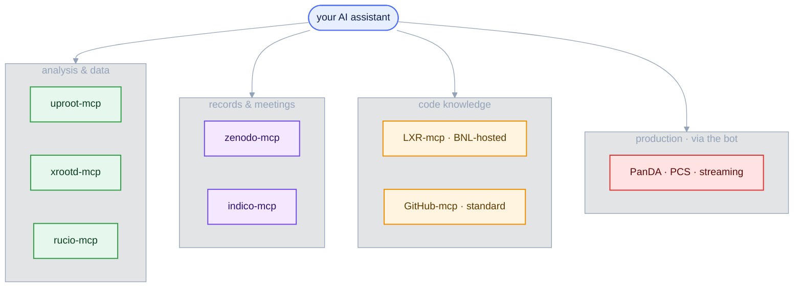

<style>
/* Mermaid: force diagram label text dark so it stays readable on the
   light node fills in BOTH light and dark mode. The Carpentries dark
   theme sets `p`/`li` color and darkens `pre` backgrounds, which would
   otherwise turn mermaid's label text light (invisible on light nodes)
   and the diagram surface dark. We override both, with !important to
   beat the theme rules and mermaid's own inline styles. */
.mermaid { background: transparent !important; }
/* Hide the Workbench "Diagram source code" spoiler under each diagram */
.mermaid-img-wrapper details { display: none !important; }
.mermaid .nodeLabel, .mermaid .edgeLabel, .mermaid .label,
.mermaid .cluster-label, .mermaid text, .mermaid tspan,
.mermaid span, .mermaid p, .mermaid foreignObject div {
  color: #10204a !important;
  fill: #10204a !important;
}
.mermaid .edgeLabel, .mermaid .edgeLabel p, .mermaid .edgeLabel rect {
  background-color: #e2e8f0 !important;
}
/* AI prompts: paste-into-your-assistant blocks. Styled like a normal
   code block (same neutral pre background/border as python etc.), with
   just a small "AI Prompt" tag in the corner. */
pre.ai-prompt, div.sourceCode.ai-prompt {
  border-top: 10px solid #7c3aed;
}
pre.ai-prompt, pre.ai-prompt code {
  white-space: pre-wrap;       /* wrap long prompts onto many lines */
  overflow-wrap: anywhere;
}
pre.ai-prompt::before, div.sourceCode.ai-prompt::before {
  content: "AI Prompt";
  display: block;
  margin-bottom: .5rem;
  font-weight: 600;
  font-size: .78em;
  letter-spacing: .03em;
  text-transform: uppercase;
  color: #7c3aed;
}
</style>

::::::::::::::::::::::::::::::::::::::::::::: questions

- Which MCP servers does EIC/ePIC provide, and which work today?
- How can you use the collaboration's AI tools with zero setup?

:::::::::::::::::::::::::::::::::::::::::::::

::::::::::::::::::::::::::::::::::::::::::::: objectives

- Decide when to run the servers yourself and when the hosted bot is enough.
- Ask DISpatcher a tool-grounded question about data, software, or production.
- Reuse tiered tool exposure and fabrication checks in your own harness.

:::::::::::::::::::::::::::::::::::::::::::::

## One protocol, many tools

MCP is a standard ([Episode 3](03-mcp-servers.md)), so the collaboration exposes each piece of its infrastructure as a small server. The three you used in this lesson are one corner of a fast-growing stack, built mostly in BNL's NPPS group (this episode distils Torre Wenaus's June 2026 talk to the ePIC user-learning WG).



*The boxes above are links — click a server to open its repository or page.*

::::::::::::::::::::::::::::::::::::::::::::: callout

## Current status

uproot/xrootd/rucio/zenodo work today and you ran three of them yourself; the LXR MCP server exists but is deployed inside the BNL-hosted services rather than as a package you run locally; indico is maintained by an individual, not the `eic` org; the production tools are reachable through the bot. See the [eic GitHub organisation](https://github.com/eic) and the [ePIC dev-cloud](https://epic-devcloud.org/doc/) for the current set.

:::::::::::::::::::::::::::::::::::::::::::::

## Analysis and data

::::::::::::::::::::::::::::::::::::::::::::: callout

## uproot-mcp — read ROOT/EDM4eic files  ·  *available · used in this lesson*

{.mcp-logo alt='uproot logo'}

[`eic/uproot-mcp-server`](https://github.com/eic/uproot-mcp-server) reads ROOT/EDM4eic files with
[uproot](https://uproot.readthedocs.io/), returning compact JSON: file structure, branch statistics, histograms, sandboxed NumPy/awkward kernels. The analysis backend from Episodes 3 and 5.

:::::::::::::::::::::::::::::::::::::::::::::

::::::::::::::::::::::::::::::::::::::::::::: callout

## xrootd-mcp — discover files on the data store  ·  *available · used in this lesson*

{.mcp-logo alt='XRootD logo'}

[`eic/xrootd-mcp-server`](https://github.com/eic/xrootd-mcp-server) ([docs](https://eic.github.io/xrootd-mcp-server/)) browses the JLab/dCache XRootD store: list directories, read metadata, search, monitor production campaigns.

:::::::::::::::::::::::::::::::::::::::::::::

::::::::::::::::::::::::::::::::::::::::::::: callout

## rucio-mcp — query the data-management system  ·  *available · used in this lesson*

{.mcp-logo alt='Rucio logo'}

[`eic/rucio-eic-mcp-server`](https://github.com/eic/rucio-eic-mcp-server) exposes [Rucio](https://rucio.cern.ch/) through ~13 tools (dataset discovery, file listing, replicas, rules). Deliberately **read-only** — an assistant gets no write access to the catalogue.

:::::::::::::::::::::::::::::::::::::::::::::

## Records and meetings

::::::::::::::::::::::::::::::::::::::::::::: callout

## zenodo-mcp — search the open-data repository  ·  *available*

{.mcp-logo alt='Zenodo logo'}

[`eic/zenodo-mcp-server`](https://github.com/eic/zenodo-mcp-server) queries [Zenodo](https://zenodo.org/) over its REST API: search records, read public datasets and DOIs — ePIC document access.

:::::::::::::::::::::::::::::::::::::::::::::

::::::::::::::::::::::::::::::::::::::::::::: callout

## indico-mcp — search meetings and agendas  ·  *available (community)*

{.mcp-logo alt='Indico logo'}

[`cohm/indico-mcp`](https://github.com/cohm/indico-mcp) searches an [Indico](https://getindico.io/) instance: find events, browse agendas, extract contributions and attachments. Maintained by an individual; works with any Indico server.

:::::::::::::::::::::::::::::::::::::::::::::

## Code knowledge

::::::::::::::::::::::::::::::::::::::::::::: callout

## LXR-mcp — source cross-reference for the assistant  ·  *available (BNL-hosted)*

The EIC runs an [LXR source cross-reference browser](https://eic-code-browser.sdcc.bnl.gov/lxr/source) over 55+ ePIC and related repositories, **re-indexed nightly** against the head of every repository. Its MCP server lets an assistant find where any symbol is defined and used, search the whole code base, and read source — so software answers are grounded in *current* code, not the model's training data (the same schema-hallucination cure you saw in Episode 3, applied to source). Paired with the standard **GitHub MCP** for PRs, commits, and issues.

:::::::::::::::::::::::::::::::::::::::::::::

## Zero setup: the DISpatcher bot

In Episode 3 you configured your own client. The collaboration also provides a hosted alternative: **DISpatcher**, a Mattermost bot in an open channel — [chat.epic-eic.org → `dispatcher`](https://chat.epic-eic.org/main/channels/dispatcher) — that anyone in ePIC can use, in the channel or by DM. All the complexity you just learned about lives in its back end; you need nothing but your Mattermost account. It is wired to **roughly 100 MCP tools**: production diagnostics (PanDA — why did my jobs fail?), the physics samples in production (PCS), the data tools you used in this lesson (rucio, xrootd, uproot), software knowledge (LXR + GitHub), and documents (Zenodo, plus a documentation RAG).

```{.ai-prompt}
(in the dispatcher channel)  Summarise the physics tags in the PCS — which processes are covered, and which tags are still draft?
```

::::::::::::::::::::::::::::::::::::::::::::: callout

## Two reusable harness patterns

The bot runs a small, low-cost model, which exposes at scale the failure modes this lesson warned about. Two of its countermeasures apply to any harness:

* **Tiered tool exposure.** Tool use degrades past roughly 30–50 tools, and the bot has ~100. So its system prompt carries only a compact list of everything; a harness loads full descriptions for just the tools each request needs; the bot can still reach the rest on demand. The same context-economy principle as skills' progressive loading in [Episode 4](04-skills.md).
* **The fabrication check.** The bot's biggest problem is making answers up instead of calling a tool — cheerfully reporting "this is fine" when nothing was actually checked. The harness hands the model a secret token **only when a tool is actually called** and requires it in the response; no token, and the user is warned the answer was probably fabricated. Verification over confidence ([Episode 1](01-why-genai-for-physics.md)), enforced mechanically.

:::::::::::::::::::::::::::::::::::::::::::::

## Beyond the bot: corun-ai

The bot answers in seconds from a small model, and its answers recede into chat history. [**`BNLNPPS/corun-ai`**](https://github.com/BNLNPPS/corun-ai) is the deliberate complement: runs that take **minutes** on high-level models, with the results preserved, browsable, and open to expert commentary. Its first application, **codoc-ai** ([epic-devcloud.org/doc](https://epic-devcloud.org/doc/)), generates software documents grounded in LXR + GitHub. Typical uses:

* *"I've been away from ePIC software development for 6 months — give me an overview of simu, reco and framework developments"* — run across several models and compared;
* documentation pages re-runnable against current code;
* one-click review of any open ePIC pull request.

Anyone can submit runs and comment — ask Torre for an account. ([`eic/corun-mcp-server`](https://github.com/eic/corun-mcp-server) wraps it as an MCP server, so your own assistant can browse and submit too.) The services are at an early stage, currently hosted on the open internet; a move to lab hosting is planned.

## Where this is going

The direction of travel is what this lesson taught in miniature: centrally hosted MCP services over HTTP (the transport you used in Episode 3) that plug equally into the bot, corun-ai, and *your own* assistant — from a single free assistant and one tool server up to a collaboration-wide ecosystem, plus a real $\Lambda^0$ measurement you carried out yourself.

::::::::::::::::::::::::::::::::::::::::::::: keypoints

- The EIC exposes its infrastructure through MCP: analysis (uproot), data (xrootd, rucio), records (zenodo, indico), code (LXR + GitHub), and production (PanDA, PCS) — three of which you ran yourself.
- The DISpatcher bot is the zero-setup path: ~100 MCP tools behind a Mattermost account, no client configuration at all.
- corun-ai/codoc-ai is the long-latency complement: high-level models, preserved and expert-curated outputs, grounded in nightly-indexed code knowledge.
- Patterns to reuse: tiered tool exposure (context economy at scale) and the secret-token fabrication check (verification over confidence, enforced).
- This catalogue dates quickly — check the eic GitHub organisation and the ePIC dev-cloud for the current list.

:::::::::::::::::::::::::::::::::::::::::::::
