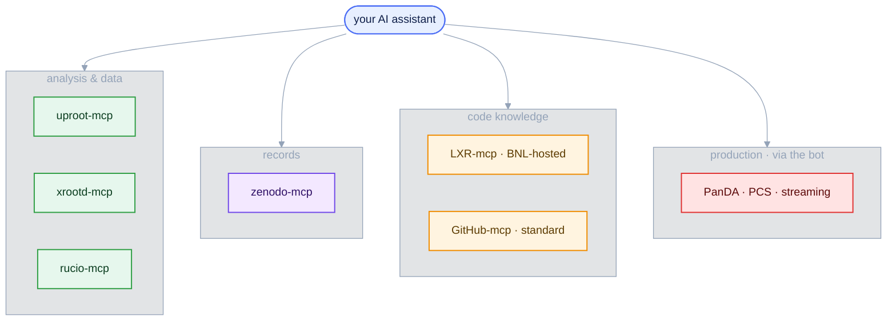

<style>
/* Mermaid: force diagram label text dark so it stays readable on the
   light node fills in BOTH light and dark mode. The Carpentries dark
   theme sets `p`/`li` color and darkens `pre` backgrounds, which would
   otherwise turn mermaid's label text light (invisible on light nodes)
   and the diagram surface dark. We override both, with !important to
   beat the theme rules and mermaid's own inline styles. */
.mermaid { background: transparent !important; }
/* Hide the Workbench "Diagram source code" spoiler under each diagram */
.mermaid-img-wrapper details { display: none !important; }
.mermaid .nodeLabel, .mermaid .edgeLabel, .mermaid .label,
.mermaid .cluster-label, .mermaid text, .mermaid tspan,
.mermaid span, .mermaid p, .mermaid foreignObject div {
  color: #10204a !important;
  fill: #10204a !important;
}
.mermaid .edgeLabel, .mermaid .edgeLabel p, .mermaid .edgeLabel rect {
  background-color: #e2e8f0 !important;
}
/* AI prompts: paste-into-your-assistant blocks. Styled like a normal
   code block (same neutral pre background/border as python etc.), with
   just a small "AI Prompt" tag in the corner. */
pre.ai-prompt, div.sourceCode.ai-prompt {
  border-top: 10px solid #7c3aed;
}
pre.ai-prompt, pre.ai-prompt code {
  white-space: pre-wrap;       /* wrap long prompts onto many lines */
  overflow-wrap: anywhere;
}
pre.ai-prompt::before, div.sourceCode.ai-prompt::before {
  content: "AI Prompt";
  display: block;
  margin-bottom: .5rem;
  font-weight: 600;
  font-size: .78em;
  letter-spacing: .03em;
  text-transform: uppercase;
  color: #7c3aed;
}
</style>

::::::::::::::::::::::::::::::::::::::::::::: questions

- Which other MCP servers does EIC provide?
- How can you use them without any setup?

:::::::::::::::::::::::::::::::::::::::::::::

::::::::::::::::::::::::::::::::::::::::::::: objectives

- Ask the DISpatcher bot a question about data, software, or production.

:::::::::::::::::::::::::::::::::::::::::::::

## More EIC servers

The three servers you used are part of a larger set, built mostly in BNL's NPPS group (this episode is based on Torre Wenaus's June 2026 talk to the ePIC user-learning WG). The [eic GitHub organization](https://github.com/eic) has the current list.


```mermaid
%%{init: {'theme':'base', 'themeVariables': {'fontSize':'15px','lineColor':'#94a3b8','edgeLabelBackground':'#e2e8f0','clusterBkg':'#1f293720','clusterBorder':'#94a3b8','titleColor':'#94a3b8'}}}%%
flowchart TB
    accTitle: {EIC MCP server catalog}
    accDescr: {EIC MCP server catalog}
    A(["your AI assistant"]):::core
    A --> DATA
    A --> REC
    A --> CODE
    A --> PROD
    subgraph DATA["analysis & data"]
        direction LR
        UP["uproot-mcp"]:::tool
        XR["xrootd-mcp"]:::tool
        RU["rucio-mcp"]:::tool
    end
    subgraph REC["records"]
        direction LR
        ZE["zenodo-mcp"]:::rec
    end
    subgraph CODE["code knowledge"]
        direction LR
        LX["LXR-mcp · BNL-hosted"]:::code
        GH["GitHub-mcp · standard"]:::code
    end
    subgraph PROD["production · via the bot"]
        direction LR
        PB["PanDA · PCS · streaming"]:::pkg
    end
    classDef core fill:#e7efff,stroke:#4c6ef5,stroke-width:1.5px,color:#10204a;
    classDef tool fill:#e6f7ed,stroke:#2f9e44,stroke-width:1.5px,color:#0b3d1f;
    classDef rec fill:#f3e8ff,stroke:#7048e8,stroke-width:1.5px,color:#2e1065;
    classDef code fill:#fff4e0,stroke:#f08c00,stroke-width:1.5px,color:#5c3b00;
    classDef pkg fill:#ffe3e3,stroke:#e03131,stroke-width:1.5px,color:#5c0a0a;
    click UP "https://github.com/eic/uproot-mcp-server" _blank
    click XR "https://github.com/eic/xrootd-mcp-server" _blank
    click RU "https://github.com/eic/rucio-eic-mcp-server" _blank
    click ZE "https://github.com/eic/zenodo-mcp-server" _blank
    click LX "https://eic-code-browser.sdcc.bnl.gov/lxr/source" _blank
    click GH "https://github.com/github/github-mcp-server" _blank
    click PB "https://chat.epic-eic.org/main/channels/dispatcher" _blank
```

*Click a box to open the server's repository or page.*

## Analysis and data

::::::::::::::::::::::::::::::::::::::::::::: callout

## uproot-mcp: read ROOT/EDM4eic files  ·  *available · used in this lesson*

{.mcp-logo alt='uproot logo'}

[`eic/uproot-mcp-server`](https://github.com/eic/uproot-mcp-server) reads ROOT files. Used in Episodes 3 and 5.

:::::::::::::::::::::::::::::::::::::::::::::

::::::::::::::::::::::::::::::::::::::::::::: callout

## xrootd-mcp: find files on the data store  ·  *available · used in this lesson*

{.mcp-logo alt='XRootD logo'}

[`eic/xrootd-mcp-server`](https://github.com/eic/xrootd-mcp-server) browses the ePIC data stores.

:::::::::::::::::::::::::::::::::::::::::::::

::::::::::::::::::::::::::::::::::::::::::::: callout

## rucio-mcp: query the data-management system  ·  *available · used in this lesson*

{.mcp-logo alt='Rucio logo'}

[`eic/rucio-eic-mcp-server`](https://github.com/eic/rucio-eic-mcp-server) searches the [Rucio](https://rucio.cern.ch/) data catalog (read-only).

:::::::::::::::::::::::::::::::::::::::::::::

## Records

::::::::::::::::::::::::::::::::::::::::::::: callout

## zenodo-mcp: search the open-data repository  ·  *available*

{.mcp-logo alt='Zenodo logo'}

[`eic/zenodo-mcp-server`](https://github.com/eic/zenodo-mcp-server) searches [Zenodo](https://zenodo.org/), including ePIC documents.

:::::::::::::::::::::::::::::::::::::::::::::

## Code knowledge

::::::::::::::::::::::::::::::::::::::::::::: callout

## LXR-mcp: source cross-reference  ·  *available (BNL-hosted)*

Searches the ePIC source code through the [LXR browser](https://eic-code-browser.sdcc.bnl.gov/lxr/source), which is updated nightly. It runs only on the BNL-hosted services.

:::::::::::::::::::::::::::::::::::::::::::::

## No setup: the DISpatcher bot

**DISpatcher** is a Mattermost bot ([chat.epic-eic.org → `dispatcher`](https://chat.epic-eic.org/main/channels/dispatcher)) that anyone in ePIC can use, in the channel or by DM. It has the data tools from this lesson plus tools for production jobs, physics samples, software, and documents.

Post this in the `dispatcher` channel or DM the bot. Your own assistant has no PCS tool and would
have to invent the answer:

```{.ai-prompt}
Summarize the physics tags in the PCS: which processes are covered, and which tags are still draft?
```

The [EIC software portal](https://eic.github.io/) also has an AI search box ("Ask anything about EIC…").

## corun-ai

[`BNLNPPS/corun-ai`](https://github.com/BNLNPPS/corun-ai) runs longer jobs with larger models and keeps the results. Its first use, [codoc-ai](https://epic-devcloud.org/doc/), writes software documentation and reviews ePIC pull requests. Ask Torre for an account.

::::::::::::::::::::::::::::::::::::::::::::: keypoints

- EIC provides more MCP servers than the three used here.
- The DISpatcher bot in Mattermost gives you these tools without any setup.

:::::::::::::::::::::::::::::::::::::::::::::
