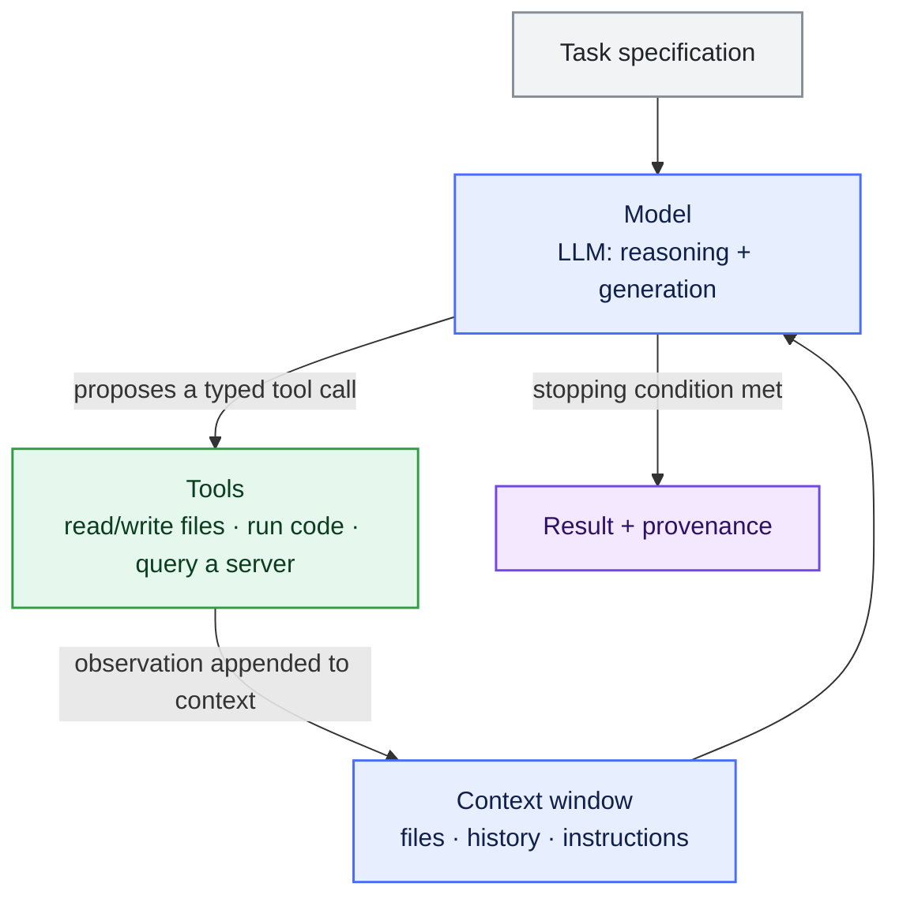
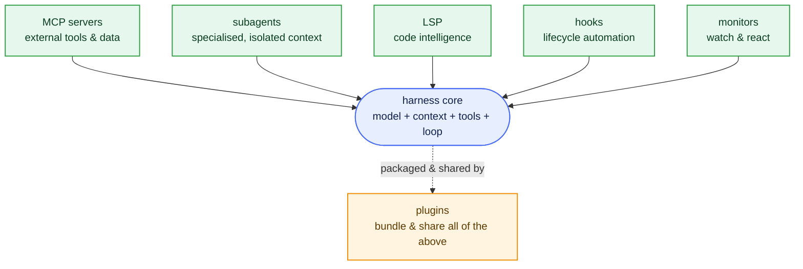

::::::::::::::::::::::::::::::::::::::::::::: questions

- How does an agentic, tool-using assistant differ from a conversational language model?
- What are the components of an LLM "harness", and why does each one matter for analysis work?
- How do modern assistants extend that core — MCP, subagents, LSP, hooks, monitors, plugins?
- How do we obtain trustworthy, reproducible results from a stochastic model?
- Why build the workflow on an open protocol rather than a single product?

:::::::::::::::::::::::::::::::::::::::::::::

::::::::::::::::::::::::::::::::::::::::::::: objectives

- Distinguish a one-shot chat completion from an agentic loop that observes and acts.
- Identify the four components of a harness: model, context, tools, and the control loop.
- Outline how the harness is extended: MCP tools, subagents, LSP, hooks, monitors, and plugins.
- Explain why verification against ground truth, not the model's confidence, establishes correctness.
- Justify an interoperability standard (MCP) as the basis for a portable, reproducible workflow.

:::::::::::::::::::::::::::::::::::::::::::::

## The bottleneck is rarely the physics

This episode frames the lesson: what a tool-using AI assistant is, why its feedback loop matters,
and how we keep its results trustworthy. Later episodes apply that framing to the decay
Λ⁰ → p π⁻.

In a typical analysis the physics is modest: select a final state, build an observable, fit a
signal. Most of the effort goes into the software around it — locating datasets, decoding a data
model, getting branch names and units right, iterating on plotting and fitting code.

LLMs compress this overhead well. But that only helps if they produce *checkable* results, the
standard the rest of this lesson holds them to.

## Two modes of use

A **chat completion** is a single forward pass. You supply a prompt, the model returns text, the
exchange ends. If that text is code, *you* execute it, inspect the error, and feed it back by hand.
The model never observes your data or the result of running anything.

An **agentic loop** wraps the same model in a control structure that lets it *act*. The model
proposes an action, an external **tool** carries it out, the result is appended to the context, and
the model is invoked again. The loop continues until a stopping condition is met.

The difference is what the model sees. In the loop it is conditioned on the actual state of your
files and the output of real computations, not on its prior alone.

::::::::::::::::::::::::::::::::::::::::::::: callout

## Scope

Here, "generative AI" means an LLM-based coding assistant in this agentic mode. We are not
discussing machine learning for reconstruction or particle identification; the object of study is
the *analysis-authoring* workflow.

:::::::::::::::::::::::::::::::::::::::::::::

## Anatomy of a harness

A model plus the machinery that makes it useful is a **harness**. It has four components.

* **Model** — performs reasoning and code generation. It is *interchangeable*: the provider and
  model are an implementation choice, not part of the method.
* **Context** — everything the model can attend to in a step: system instructions, relevant files,
  prior turns, tool outputs. It is bounded (the *context window*, measured in tokens), so what is
  included, and when, is a deliberate decision.
* **Tools** — the operations the model may invoke, each with a typed interface (name, arguments,
  return schema). Tools are the only channel through which the model affects the outside world.
* **Control loop** — the policy that alternates *propose → execute → observe* until the task is
  complete. This is what distinguishes an agent from a chatbot.

::::::::::::::::::::::::::::::::::::::::::::: callout

## Why the loop is essential, not cosmetic

Feeding tool results back lets the assistant compare its output against ground truth and correct
course: read the actual branch names rather than guessing, run a fit and read back its χ²/ndf,
refit if the peak is misplaced. A single completion cannot, because it never observes a consequence
of its actions.

:::::::::::::::::::::::::::::::::::::::::::::

## Extending the harness: the modern toolkit

Production assistants keep that small core — model, context, tools, loop — and surround it with
standard extension points. You will not need all of them here, but the vocabulary recurs in every
modern assistant's documentation.

* **MCP servers** — the *tools* layer, standardised. A server exposes tools, data, and prompts over
  the Model Context Protocol so one implementation works in any client. This is how we give the
  assistant physics capabilities ([Episode 3](03-mcp-servers.md)).
* **Subagents (agents)** — a separate assistant instance with its own context window, tools, and
  instructions, spawned to handle a sub-task and report back. They isolate context and enable
  divide-and-conquer over large jobs.
* **Skills** — packaged, versioned *procedures* (a `SKILL.md` plus scripts) loaded on demand when a
  request matches ([Episode 4](04-skills.md)). A tool is a capability; a skill is a recipe that
  orchestrates capabilities.
* **LSP (Language Server Protocol)** — the language servers behind editor autocomplete, giving the
  assistant real code intelligence: go-to-definition, references, types, and *compiler diagnostics*,
  instead of guessing about a codebase.
* **Hooks** — user scripts triggered on lifecycle events (before/after a tool call, on prompt
  submit, on session stop). They enforce policy and automate deterministically — format after an
  edit, block a dangerous command, record a provenance log.
* **Monitors** — mechanisms that watch long-running or background state (a build, a job queue, a set
  of files) and react: notifying you or re-invoking the assistant when something finishes or
  changes. They close the loop around work that outlives a single turn.
* **Plugins** — the *packaging* layer. A plugin bundles commands, subagents, skills, hooks, and MCP
  servers into one installable, versioned unit, so a collaboration can share a whole capability set
  at once.

| Component | What it adds to the core loop | In this tutorial |
| --- | --- | --- |
| MCP servers | external tools & data, client-agnostic | Episodes 3 & 5 (the uproot/xrootd servers) |
| Subagents | isolated, specialised helpers | discussed in Episode 5 |
| Skills | reusable, versioned procedures | Episode 4 (`SKILL.md`) |
| LSP | code intelligence & diagnostics | background (your editor) |
| Hooks | deterministic lifecycle automation | mentioned as best practice |
| Monitors | watch & react to background work | mentioned for long jobs |
| Plugins | bundle & share all of the above | the collaboration's distribution model |

::::::::::::::::::::::::::::::::::::::::::::: callout

## Plugins are how this becomes shareable

A *plugin* is a container for the other components — commands, subagents, skills, hooks, MCP
servers — so an entire workflow installs in one step. For a collaboration, that is the path from
"I configured my assistant" to "everyone runs the same vetted setup." See the Claude Code
[plugin components reference](https://code.claude.com/docs/en/plugins-reference#plugin-components-reference)
for one implementation.

:::::::::::::::::::::::::::::::::::::::::::::

## Correctness comes from verification, not confidence

All this machinery serves one thing: results you can trust. That is hard, because an LLM is
stochastic. Identical prompts can yield different outputs, and a fluent, confident answer is not
evidence of a correct one.

So the discipline is simple. Treat every model output as a **hypothesis**, and accept it only after
checking it against something external: the data itself, a fit statistic, a known physical value, or
an independent implementation. The agentic loop earns its keep by making such checks cheap and
automatic.

This shapes how we work. Favour tools that return compact, inspectable quantities — counts, edges,
fit parameters — over opaque ones, and keep a record of what was run so a result can be reproduced
and audited. Reproducibility and provenance are the criteria by which an automated result earns
trust.

::::::::::::::::::::::::::::::::::::::::::::: challenge

## Discussion: what does the loop buy you?

For the Λ⁰ → p π⁻ analysis, identify two failure modes of a one-shot completion that an agentic
loop removes.

::::::::::::::: solution

1. **Hallucinated schema.** A one-shot model may emit a plausible but wrong branch name (for
   example `ReconstructedParticles.px` instead of `ReconstructedChargedParticles.momentum.x`). An
   agent can query the file and use the real names.
2. **Unvalidated fit.** A one-shot model cannot know whether its fit converged or where the peak
   landed. An agent can execute the fit, read μ, σ, and χ²/ndf, and iterate.

Both are the same principle: conditioning on observations beats conditioning on the prior.

:::::::::::::::

:::::::::::::::::::::::::::::::::::::::::::::

## Where this sits

Generative AI is already part of the research software ecosystem — for code development and review,
navigating large codebases, and searching technical documentation. The ePIC collaboration, which
produced the data used here, applies these tools in several such roles.

This lesson is a self-contained, low-cost entry point: with a free assistant and a single tool
server you will carry out a complete measurement on real ePIC data.

## Portability through an open protocol

One question remains: how do we keep this from going stale? The assistant market changes on a
timescale of months, so we depend on a standard rather than a product.

::::::::::::::::::::::::::::::::::::::::::::: callout

## One interface, many assistants

The **Model Context Protocol (MCP)** is an open standard for exposing tools to language-model
clients. A tool implemented once against MCP works in any compliant assistant — like a hardware bus
that decouples peripherals from hosts. In [Episode 3](03-mcp-servers.md) you connect the EIC tool
servers to your assistant and see that any MCP-compliant client connects the same way — what makes
the workflow reproducible across environments.

:::::::::::::::::::::::::::::::::::::::::::::

The [next episode](02-your-ai-coding-setup.md) sets up a working assistant and states the physics
measurement precisely.

::::::::::::::::::::::::::::::::::::::::::::: keypoints

- A conversational model returns text; an agentic harness executes tools and conditions on their output.
- A harness has four parts: the model, the context window, a set of typed tools, and a control loop.
- Modern assistants extend the loop with MCP tools, subagents, LSP code intelligence, hooks, and monitors; plugins bundle these to share.
- LLM output is stochastic and must be treated as a hypothesis to be checked against data, fits, and known values.
- The agentic loop makes self-verification possible: the assistant can run the analysis and react to the result.
- Building on the open Model Context Protocol keeps tools portable across assistants and supports reproducibility.

:::::::::::::::::::::::::::::::::::::::::::::
