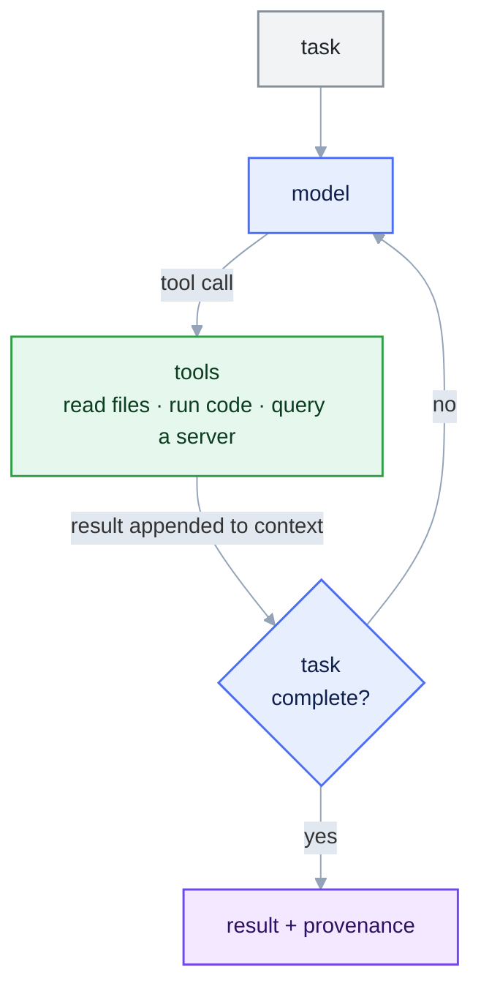
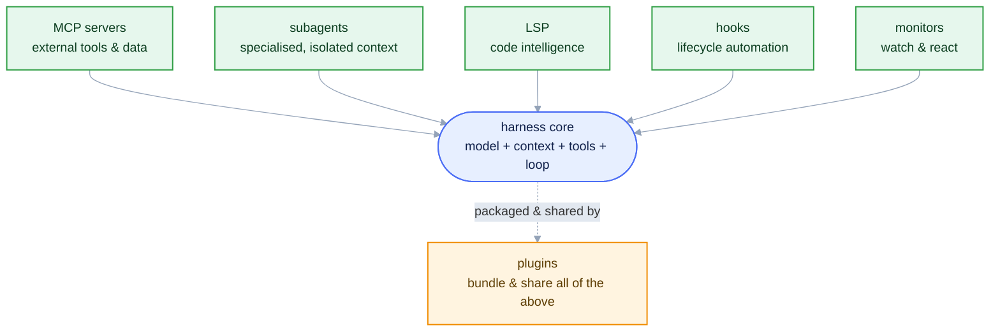
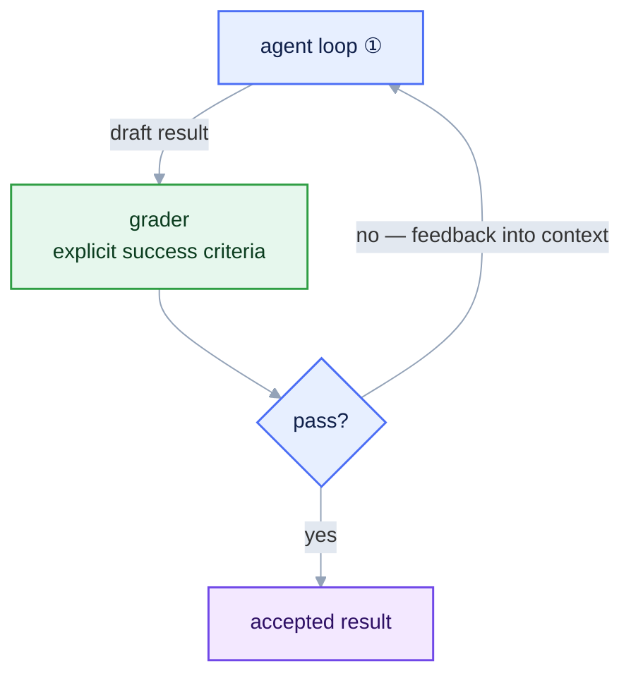
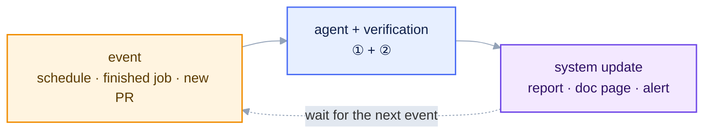

::::::::::::::::::::::::::::::::::::::::::::: questions

- How does an agentic assistant differ from a chat model?
- What are the parts of an LLM "harness"?
- What loops sit around the agent loop, and what does each add?
- How do we get trustworthy results from a stochastic model?
- Why build on an open protocol, not one product?

:::::::::::::::::::::::::::::::::::::::::::::

::::::::::::::::::::::::::::::::::::::::::::: objectives

- Distinguish a chat completion from an agentic loop.
- Name the four harness parts: model, context, tools, loop.
- Describe the four loop levels: agent → verification → operation → improvement.
- List the harness extensions (MCP, subagents, hooks, …).
- Explain why verification beats model confidence.
- Justify MCP as the basis for a portable workflow.

:::::::::::::::::::::::::::::::::::::::::::::

## The bottleneck is rarely the physics

In a typical analysis the physics is modest: select a final state, build an observable, fit a
signal. Most effort goes into the software around it — locating datasets, decoding a data model,
getting branch names and units right, iterating on plotting and fitting code. LLMs compress this
overhead well, but only if they produce *checkable* results. Later episodes apply this to the decay
$\Lambda^0 \to p\,\pi^-$.

## Two modes of use

A **chat completion** is a single forward pass: prompt in, text out, exchange ends. If that text is
code, *you* execute it, inspect the error, and feed it back by hand. The model never observes your
data or the result of running anything.

An **agentic loop** wraps the same model in a control structure that lets it *act*: the model
proposes an action, an external **tool** carries it out, the result is appended to the context, and
the model is invoked again — until a stopping condition is met. In the loop the model is conditioned
on the actual state of your files and real computation output, not on its prior alone.

::::::::::::::::::::::::::::::::::::::::::::: callout

## Scope

Here, "generative AI" means an LLM-based coding assistant in this agentic mode — not machine
learning for reconstruction or particle identification. The object of study is the
*analysis-authoring* workflow.

:::::::::::::::::::::::::::::::::::::::::::::

That loop is the first of **four**, each wrapped around the one before it. This episode walks up
the stack; the rest of the lesson has you build the inner two yourself and shows the outer two
running at collaboration scale.

## Level 1 — the agent loop

The basic cycle could not be simpler: the model calls a tool, looks at what came back, and decides
whether it is done.

A model plus the machinery that runs this cycle is a **harness**, and it has exactly four parts:

* **Model** — reasoning and code generation. *Interchangeable*: provider and model are an
  implementation choice, not part of the method.
* **Context** — everything the model attends to in a step: system instructions, files, prior turns,
  tool outputs. Bounded by the *context window* (in tokens), so what is included, and when, is
  deliberate.
* **Tools** — operations the model may invoke, each with a typed interface (name, arguments, return
  schema). The only channel through which the model affects the outside world.
* **Control loop** — the policy that alternates *propose → execute → observe* until done. This
  distinguishes an agent from a chatbot.

::::::::::::::::::::::::::::::::::::::::::::: callout

## Why the loop is essential, not cosmetic

Feeding tool results back lets the assistant correct course against ground truth: read the actual
branch names rather than guessing, run a fit and read back its $\chi^2/\mathrm{ndf}$, refit if the peak is
misplaced. A single completion cannot, because it never observes a consequence of its actions.

:::::::::::::::::::::::::::::::::::::::::::::

### Extending the harness: the modern toolkit

Production assistants keep that small core and surround it with standard extension points. The
vocabulary recurs in every modern assistant's documentation.

* **MCP servers** — the *tools* layer, standardised. A server exposes tools, data, and prompts over
  the Model Context Protocol so one implementation works in any client. This is how we give the
  assistant physics capabilities ([Episode 3](03-mcp-servers.md)).
* **Subagents (agents)** — a separate assistant instance with its own context window, tools, and
  instructions, spawned for a sub-task. They isolate context and enable divide-and-conquer.
* **Skills** — packaged, versioned *procedures* (a `SKILL.md` plus scripts) loaded on demand when a
  request matches ([Episode 4](04-skills.md)). A tool is a capability; a skill is a recipe.
* **LSP (Language Server Protocol)** — the language servers behind editor autocomplete, giving real
  code intelligence: go-to-definition, references, types, and *compiler diagnostics*.
* **Hooks** — user scripts triggered on lifecycle events (before/after a tool call, on prompt
  submit, on session stop). They enforce policy deterministically — format after an edit, block a
  dangerous command, record a provenance log.
* **Monitors** — watch long-running background state (a build, a job queue, files) and react,
  notifying you or re-invoking the assistant when something finishes. They close the loop around work
  that outlives a single turn.
* **Plugins** — the *packaging* layer. A plugin bundles commands, subagents, skills, hooks, and MCP
  servers into one installable, versioned unit, so a collaboration shares a whole capability set at
  once.

| Component | What it adds to the core loop | In this tutorial |
| --- | --- | --- |
| MCP servers | external tools & data, client-agnostic | Episodes 3 & 5 (the [uproot](https://github.com/eic/uproot-mcp-server)/[xrootd](https://github.com/eic/xrootd-mcp-server) servers) |
| Subagents | isolated, specialised helpers | discussed in Episode 5 |
| Skills | reusable, versioned procedures | Episode 4 (`SKILL.md`) |
| LSP | code intelligence & diagnostics | background (your editor) |
| Hooks | deterministic lifecycle automation | mentioned as best practice |
| Monitors | watch & react to background work | mentioned for long jobs |
| Plugins | bundle & share all of the above | the collaboration's distribution model |

## Level 2 — the verification loop

A level-1 agent stops when *it* thinks the task is complete — and an LLM is stochastic: identical
prompts can yield different outputs, and a confident answer is not evidence of a correct one. The
fix is a second loop around the first: a **grader** checks the agent's result against explicit
acceptance criteria before it is accepted, and a failure goes back in as feedback for another
attempt.

The discipline behind it: treat every model output as a **hypothesis**, accepted only after
checking it against something external — the data, a fit statistic, a known physical value, or an
independent implementation. For the $\Lambda^0$ measurement the criteria are physical and
checkable: $|\mu - 1.115683\,\mathrm{GeV}| < 5\,\mathrm{MeV}$, $\sigma$ consistent with detector
resolution, $\chi^2/\mathrm{ndf}$ of order 1. In [Episode 4](04-skills.md) you will write exactly
this grader into the lambda-fit skill's **success criteria** — and a passing agent reports the
numbers, while a failing one must report the failure, not a result.

Grading costs time and tokens. It is the right trade wherever correctness matters more than speed —
in physics, almost always. So favour tools that return compact, inspectable quantities — counts,
edges, fit parameters — and keep a record of what was run: reproducibility and provenance are the
criteria by which an automated result earns trust. At collaboration scale the grader can be
mechanical, like the secret-token fabrication check in [Episode 6](06-eic-mcp-servers.md).

## Level 3 — the operation loop

With verification in place, the agent no longer needs you to press enter. A third loop makes it a
*component*: an event — a schedule, a finished production job, a new pull request — triggers the
agent, its verified output updates something (a report, a documentation page, an alert), and the
system goes back to waiting.

Hooks and monitors (above) are the entry-level version of this. The collaboration-scale version is
in [Episode 6](06-eic-mcp-servers.md): documentation regenerated on schedule against the current
code base, and pull-request reviews triggered per PR.

## Level 4 — the improvement loop, in a word

There is one more loop, around everything: periodically look at what the agent *actually did* —
transcripts, failed fits, wrong tool choices — and feed that back into the **harness itself**:
sharpen `AGENTS.md`, tighten a skill's success criteria, add the missing tool. Levels 1–3 make the
agent do the work; level 4 makes the agent *better at* the work, which is where the gains compound.
You will practise a small version of it every time a prompt in this lesson goes wrong and you fix
the instructions instead of retyping the request.

::::::::::::::::::::::::::::::::::::::::::::: callout

## Where a human belongs in each loop

Autonomy does not mean absence of judgement — each level has a natural checkpoint: approving a
sensitive tool call (①), signing off a graded result (②), reviewing what runs unattended (③),
and deciding which harness changes to keep (④). Put yourself at the checkpoints, not in the
middle of the loop.

:::::::::::::::::::::::::::::::::::::::::::::

::::::::::::::::::::::::::::::::::::::::::::: challenge

## Discussion: what does the loop buy you?

For the $\Lambda^0 \to p\,\pi^-$ analysis, identify two failure modes of a one-shot completion that an
agentic loop removes.

::::::::::::::: solution

1. **Hallucinated schema.** A one-shot model may emit a plausible but wrong branch name (for
   example `ReconstructedParticles.px` instead of `ReconstructedChargedParticles.momentum.x`). An
   agent can query the file and use the real names.
2. **Unvalidated fit.** A one-shot model cannot know whether its fit converged or where the peak
   landed. An agent can execute the fit, read $\mu$, $\sigma$, and $\chi^2/\mathrm{ndf}$, and iterate.

Both are the same principle: conditioning on observations beats conditioning on the prior. The
first is fixed at level 1 (observe, don't guess), the second at level 2 (grade, don't trust).

:::::::::::::::

:::::::::::::::::::::::::::::::::::::::::::::

## Where this sits

Generative AI is already part of the research software ecosystem — code development and review,
navigating large codebases, searching technical documentation. The ePIC collaboration, which
produced the data used here, applies these tools in several such roles. This lesson is a
self-contained, low-cost entry point: with a free assistant and a single tool server you will carry
out a complete measurement on real ePIC data.

## Portability through an open protocol

The assistant market changes on a timescale of months, so we depend on a standard rather than a
product.

::::::::::::::::::::::::::::::::::::::::::::: callout

## One interface, many assistants

The **Model Context Protocol (MCP)** is an open standard for exposing tools to language-model
clients. A tool implemented once against MCP works in any compliant assistant — like a hardware bus
that decouples peripherals from hosts. In [Episode 3](03-mcp-servers.md) you connect the EIC tool
servers and see that any MCP-compliant client connects the same way, making the workflow
reproducible across environments.

:::::::::::::::::::::::::::::::::::::::::::::

The [next episode](02-your-ai-coding-setup.md) states the physics measurement; you install an
assistant on the [Setup](../learners/setup.md) page.

::::::::::::::::::::::::::::::::::::::::::::: keypoints

- A conversational model returns text; an agentic harness executes tools and conditions on their output.
- Level 1, the agent loop, runs in a harness with four parts: the model, the context window, a set of typed tools, and a control loop — extended by MCP tools, subagents, LSP, hooks, and monitors, with plugins to bundle and share.
- Level 2 wraps the agent in a verification loop: a grader checks each result against explicit success criteria, because stochastic output must be treated as a hypothesis, not an answer.
- Level 3 runs the verified agent on events and schedules; level 4 feeds what actually happened back into the harness, where gains compound.
- Building on the open Model Context Protocol keeps tools portable across assistants and supports reproducibility.

:::::::::::::::::::::::::::::::::::::::::::::

<small>The four-level loop schematics are adapted from
[*The Art of Loop Engineering*](https://www.langchain.com/blog/the-art-of-loop-engineering).</small>
