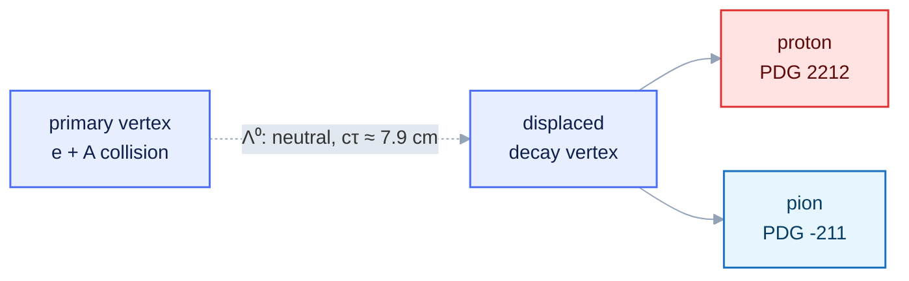

::::::::::::::::::::::::::::::::::::::::::::: questions

- Which assistants provide an agentic loop at low or no cost?
- What capabilities must any assistant expose for this workflow?
- What is the observable, and what are its signal and background?

:::::::::::::::::::::::::::::::::::::::::::::

::::::::::::::::::::::::::::::::::::::::::::: objectives

- Install and authenticate one free agentic assistant.
- Map an assistant's interface onto the harness: context, tools, and the control loop.
- State the Λ⁰ → p π⁻ observable and explain the origin of its peak and background.
- Identify the EDM4eic collections and units the measurement requires.

:::::::::::::::::::::::::::::::::::::::::::::

## Choosing an assistant

Several assistants expose an agentic loop for free, at least for moderate use. This table is a mid-2026 snapshot; pricing and limits change, so verify current terms. Any of them works here.

| Tool | Interface | Free access | MCP support |
| --- | --- | --- | --- |
| GitHub Copilot | VS Code, CLI | free tier; free Pro for verified students/educators/OSS maintainers | yes |
| Claude Code | terminal | limited starter credit; education programmes | yes |
| opencode | terminal | open source (MIT); free hosted models (no key), or bring your own key / a local model | yes |
| Cursor | dedicated editor | free tier | yes |
| Cline / Continue | VS Code extensions | open source; bring your own key | yes |

::::::::::::::::::::::::::::::::::::::::::::: callout

## Two senses of "free"

**Open-source clients** (opencode, Cline, Continue) install free but bill per token — zero marginal cost only with a local model (e.g. via Ollama). **Commercial free tiers** (Copilot Free, Cursor) bundle a quota, then meter.

:::::::::::::::::::::::::::::::::::::::::::::

## The capabilities that matter

The workflow needs three non-model components of the harness from [Episode 1](01-why-genai-for-physics.md):

1. a conversational interface (specify the task, read results),
2. read/write access to project files (context), and
3. command/tool execution with output returned to the model (the control loop).

If an assistant only emits code for you to run by hand, enable its **agent** or **edit** mode to close the loop.

## Install one assistant

You need only one. Each option is self-contained.

::::::::::::::: spoiler

## Option A — GitHub Copilot (VS Code or CLI)

1. Install [Visual Studio Code](https://code.visualstudio.com/).
2. Install the **GitHub Copilot** and **GitHub Copilot Chat** extensions.
3. Authenticate with a GitHub account; students and educators get Copilot Pro free.
4. Open Copilot Chat and select **Agent** mode.

Terminal: the **GitHub Copilot CLI** (`copilot`) is agentic and speaks MCP. Sign in with `gh auth login`, run headless with `copilot -p "<request>" --allow-all`. MCP servers go in `~/.copilot/mcp-config.json` (Episode 3).

:::::::::::::::

::::::::::::::: spoiler

## Option B — Claude Code (terminal)

1. Install [Node.js](https://nodejs.org/) (LTS).
2. `npm install -g @anthropic-ai/claude-code`
3. Run `claude` in a project directory and authenticate once.
4. `/help` lists commands; `/mcp` (Episode 3) lists connected tool servers.

:::::::::::::::

::::::::::::::: spoiler

## Option C — opencode (open source, terminal)

1. Install from [opencode.ai](https://opencode.ai).
2. Choose a model. opencode ships **free hosted models** that need no key — run `opencode models` and pick one ending in `-free`. Or bring your own key, or run a local model via [Ollama](https://ollama.com).
3. Run headless with `opencode run -m <provider/model> "<request>"`, or `opencode` interactively.
4. MCP servers are declared in `opencode.jsonc` (Episode 3).

:::::::::::::::

::::::::::::::::::::::::::::::::::::::::::::: challenge

## Exercise: confirm the loop is closed (≈ 10 min)

Create an empty directory `lambda-analysis`, open it in your assistant, and issue:

```
Create hello.py that prints the PDG value of the Lambda baryon mass in GeV, then run it.
```

Verify the assistant both **wrote** the file and **executed** it.

::::::::::::::: solution

The assistant should create `hello.py`, run it, and report:

```output
1.115683
```

If it only displayed code without running it, enable agent/edit mode. Executing, not suggesting, is the behaviour this lesson relies on.

:::::::::::::::

:::::::::::::::::::::::::::::::::::::::::::::

::::::::::::::::::::::::::::::::::::::::::::: callout

## One project, any assistant

Configure the *project*, not each tool. Write your rules once in an `AGENTS.md` at the root of `lambda-analysis/`; modern assistants (opencode, Cursor, Codex, Gemini CLI) read it automatically. A tool with its own file (Claude Code reads `CLAUDE.md`) gets a one-line *bridge* pointing back to `AGENTS.md`. You set this up in [Episode 4](04-skills.md): *standards in the centre, tools at the edges*.

:::::::::::::::::::::::::::::::::::::::::::::

## The measurement: Λ⁰ → p π⁻

The Λ⁰ is the lightest strange baryon (uds, spin-parity ½⁺). It decays only weakly (a strangeness-changing ΔS = 1 transition), so it is long-lived: cτ ≈ 7.9 cm. Its dominant hadronic mode is

```
Λ⁰ → p + π⁻      (branching fraction ≈ 63.9%)
```

The macroscopic lifetime makes the decay a **V0**: two oppositely charged tracks from a vertex displaced from the primary interaction point.



### The observable

The Λ⁰ is neutral and not detected directly; we reconstruct it from its charged daughters. For a candidate proton *p*₁ = (E₁, **p**₁) and candidate pion *p*₂ = (E₂, **p**₂), the pair's **invariant mass** is Lorentz invariant:

```
E_i = sqrt(|p_i|^2 + m_i^2)          with m_i the assigned proton or pion mass

m(p, π) = sqrt( (E_1 + E_2)^2 − |p_1 + p_2|^2 )
```

Assign the proton mass to one track and the pion mass to the other (using reconstructed particle ID). For true Λ⁰ decays this equals the parent mass; candidates accumulate in a **peak at 1.115683 GeV**.

::::::::::::::::::::::::::::::::::::::::::::: callout

## Width: resolution, not lifetime

The Λ⁰ natural width (Γ = ħ/τ ≈ 2.5 × 10⁻⁶ eV) is far below any detector effect. The observed peak width — a few MeV — measures **detector momentum and angular resolution**, not the particle.

:::::::::::::::::::::::::::::::::::::::::::::

### Background

Most proton–pion pairs share no common Λ⁰. These random ("combinatorial") pairs do not peak; they form a smooth distribution under the signal. The analysis extracts a yield by fitting a Gaussian peak on a low-order polynomial background (Episode 5). The charge-conjugate mode Λ̄ → p̄ π⁺ is reconstructed identically with the antiparticles.

::::::::::::::::::::::::::::::::::::::::::::: callout

## Reference values (PDG)

| Quantity | Value |
| --- | --- |
| m(Λ⁰) | 1.115683 GeV |
| m(p) | 0.9382720813 GeV |
| m(π±) | 0.13957061 GeV |
| cτ(Λ⁰) | 7.89 cm |
| BR(Λ⁰ → p π⁻) | 63.9 % |

Energies and momenta are in GeV (natural units, *c* = 1).

:::::::::::::::::::::::::::::::::::::::::::::

## The data model

ePIC reconstruction output uses **EDM4eic**, an EIC extension of EDM4hep generated with [PODIO](../learners/reference.md). A file contains an `events` tree; each entry is one event, each branch a **collection**. We need one collection, the reconstructed charged tracks, and four members:

```
events  (tree; one entry per event)
    ReconstructedChargedParticles.PDG          reconstructed particle-ID hypothesis
    ReconstructedChargedParticles.momentum.x   p_x  [GeV]
    ReconstructedChargedParticles.momentum.y   p_y  [GeV]
    ReconstructedChargedParticles.momentum.z   p_z  [GeV]
```

`PDG` is the Particle Data Group code the reconstruction assigns each track. Select protons (`2212`) and π⁻ (`-211`) for Λ⁰, antiprotons (`-2212`) and π⁺ (`211`) for Λ̄.

::::::::::::::::::::::::::::::::::::::::::::: callout

## Caveat: PID is a hypothesis too

The `PDG` field is the reconstruction's best guess, not truth. Misidentification feeds the combinatorial background — one reason a fit, not a count, is required.

:::::::::::::::::::::::::::::::::::::::::::::

You do not download a file. In [Episode 3](03-mcp-servers.md) the assistant uses the **rucio** tools to find a DIS dataset and **xrootd** to verify its files, then reads one of the dataset's `root://` URLs (e.g. `root://dtn-eic.jlab.org//...`) **in place** with the **uproot** tools — pulling exactly these branches without writing any I/O code.

::::::::::::::::::::::::::::::::::::::::::::: keypoints

- GitHub Copilot, Claude Code, and opencode each provide an agentic loop at little or no cost.
- Any usable assistant must read/write files and execute commands, not merely emit text.
- The observable is the p π⁻ invariant mass; the Λ⁰ appears as a narrow peak over a combinatorial background.
- The peak width is set by detector resolution, not the negligible Λ⁰ natural width.
- The data are EDM4eic collections in an `events` tree; momenta are in GeV.

:::::::::::::::::::::::::::::::::::::::::::::
