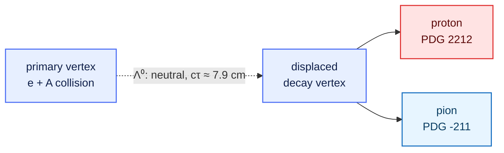

::::::::::::::::::::::::::::::::::::::::::::: questions

- Which assistants provide an agentic loop at low or no cost?
- What capabilities must any assistant expose for this workflow?
- What is the observable, and what are its signal and background?

:::::::::::::::::::::::::::::::::::::::::::::

::::::::::::::::::::::::::::::::::::::::::::: objectives

- Install and authenticate one free agentic assistant.
- Map an assistant's interface onto the harness: context, tools, and the control loop.
- State the Λ⁰ → p π⁻ observable and explain the origin of its peak and background.
- Identify the EDM4eic collections and units the measurement requires.

:::::::::::::::::::::::::::::::::::::::::::::

## Choosing an assistant

Several assistants expose an agentic loop at no cost, at least for moderate use. The table below
is a snapshot (mid-2026); pricing and limits change frequently, so verify current terms before
relying on them. For this lesson any of these is sufficient.

| Tool | Interface | Free access | MCP support |
| --- | --- | --- | --- |
| GitHub Copilot | VS Code, CLI | free tier; free Pro for verified students/educators/OSS maintainers | yes |
| Claude Code | terminal | limited starter credit; education programmes | yes |
| opencode | terminal | open source (MIT); free hosted models (no key), or bring your own key / a local model | yes |
| Cursor | dedicated editor | free tier | yes |
| Cline / Continue | VS Code extensions | open source; bring your own key | yes |

::::::::::::::::::::::::::::::::::::::::::::: callout

## Two senses of "free"

**Open-source clients** (opencode, Cline, Continue) are free to install but bill through your
chosen model provider per token — zero marginal cost only if paired with a local model (e.g.
via Ollama). **Commercial free tiers** (Copilot Free, Cursor) bundle a usage quota and then
meter. Either is adequate here; the choice does not affect the method.

:::::::::::::::::::::::::::::::::::::::::::::

## The capabilities that matter

Independent of the product, the workflow requires three capabilities, which are exactly the
non-model components of the harness from [Episode 1](01-why-genai-for-physics.md):

1. a conversational interface (to specify the task and read results),
2. read/write access to project files (context), and
3. command or tool execution with the output returned to the model (the control loop).

If an assistant only emits code for you to run by hand, it is operating as a chat completion;
enable its **agent** or **edit** mode to close the loop.

## Install one assistant

You need only one. Each option below is self-contained.

::::::::::::::: spoiler

## Option A — GitHub Copilot (VS Code or CLI)

1. Install [Visual Studio Code](https://code.visualstudio.com/).
2. Install the **GitHub Copilot** and **GitHub Copilot Chat** extensions.
3. Authenticate with a GitHub account; students and educators can obtain Copilot Pro at no cost.
4. Open Copilot Chat and select **Agent** mode.

Prefer the terminal? The **GitHub Copilot CLI** (`copilot`) is an agentic client that also
speaks MCP. Install it, sign in with `gh auth login`, and run headless with
`copilot -p "<request>" --allow-all`. MCP servers go in `~/.copilot/mcp-config.json`
(added in Episode 3).

:::::::::::::::

::::::::::::::: spoiler

## Option B — Claude Code (terminal)

1. Install [Node.js](https://nodejs.org/) (LTS).
2. `npm install -g @anthropic-ai/claude-code`
3. Run `claude` in a project directory and authenticate once.
4. `/help` lists commands; `/mcp` (used in Episode 3) lists connected tool servers.

:::::::::::::::

::::::::::::::: spoiler

## Option C — opencode (open source, terminal)

1. Install from [opencode.ai](https://opencode.ai).
2. Choose a model. opencode ships **free hosted models** that need no key — run `opencode models`
   and pick one whose name ends in `-free`. You can instead bring your own key for a paid model,
   or run a local model via [Ollama](https://ollama.com) for zero per-token cost.
3. Run headless with `opencode run -m <provider/model> "<request>"`, or just `opencode` for an
   interactive session.
4. MCP servers are declared in `opencode.jsonc` (added in Episode 3).

:::::::::::::::

::::::::::::::::::::::::::::::::::::::::::::: challenge

## Exercise: confirm the loop is closed (≈ 10 min)

Create an empty directory `lambda-analysis`, open it in your assistant, and issue the request:

```
Create hello.py that prints the PDG value of the Lambda baryon mass in GeV, then run it.
```

Verify that the assistant both **wrote** the file and **executed** it.

::::::::::::::: solution

You should see the assistant create `hello.py`, run it, and report the output:

```output
1.115683
```

If it only displayed code without running it, it is in chat mode — enable agent/edit mode.
Executing, not suggesting, is the behaviour this lesson relies on.

:::::::::::::::

:::::::::::::::::::::::::::::::::::::::::::::

::::::::::::::::::::::::::::::::::::::::::::: callout

## One project, any assistant

You configure the *project*, not each tool. Write your project's rules once in an `AGENTS.md` at
the root of `lambda-analysis/`, and modern assistants read it automatically — opencode (Option C),
Cursor, Codex, Gemini CLI, and others. For a tool that looks for its own file instead (Claude Code
reads `CLAUDE.md`), a one-line *bridge* points back to the same `AGENTS.md`, so you never keep two
copies. You will set this up properly in [Episode 4](04-skills.md); the principle —
*standards in the centre, tools at the edges* — is what keeps the workflow consistent whichever
assistant you, or a collaborator, happen to run.

:::::::::::::::::::::::::::::::::::::::::::::

## The measurement: Λ⁰ → p π⁻

The Λ⁰ is the lightest strange baryon (quark content uds, spin-parity ½⁺). It decays only through
the weak interaction (a strangeness-changing, ΔS = 1 transition), which makes it long-lived:
cτ ≈ 7.9 cm. Its dominant hadronic mode is

```
Λ⁰ → p + π⁻      (branching fraction ≈ 63.9%)
```

Because the lifetime is macroscopic, the decay produces a **V0**: two oppositely charged tracks
emerging from a vertex that is displaced from the primary interaction point.



### The observable

The Λ⁰ is neutral and is not detected directly; we reconstruct it from its charged daughters. For
a candidate proton with four-momentum *p*₁ = (E₁, **p**₁) and a candidate pion *p*₂ = (E₂, **p**₂),
the **invariant mass** of the pair is Lorentz invariant:

```
E_i = sqrt(|p_i|^2 + m_i^2)          with m_i the assigned proton or pion mass

m(p, π) = sqrt( (E_1 + E_2)^2 − |p_1 + p_2|^2 )
```

We assign the proton mass to one track and the pion mass to the other (using the reconstructed
particle ID, below). For true Λ⁰ decays this quantity equals the parent mass; the candidates
accumulate in a **peak at 1.115683 GeV**.

::::::::::::::::::::::::::::::::::::::::::::: callout

## Width: resolution, not lifetime

The Λ⁰ natural width (Γ = ħ/τ ≈ 2.5 × 10⁻⁶ eV) is many orders of magnitude below any detector
effect. The observed peak width — a few MeV — is therefore a measurement of the **detector
momentum and angular resolution**, not of the particle itself. Keep this distinction in mind
when you interpret the fitted σ.

:::::::::::::::::::::::::::::::::::::::::::::

### Background

Most proton–pion pairs in an event do **not** come from a common Λ⁰. These random ("combinatorial")
pairs do not peak; they form a smooth distribution under and around the signal. The analysis
therefore extracts a yield by fitting a peak (a Gaussian) on top of a smooth background (a low-order
polynomial), as you will do in Episode 5. The charge-conjugate mode Λ̄ → p̄ π⁺ is reconstructed
identically with the antiparticles.

::::::::::::::::::::::::::::::::::::::::::::: callout

## Reference values (PDG)

| Quantity | Value |
| --- | --- |
| m(Λ⁰) | 1.115683 GeV |
| m(p) | 0.9382720813 GeV |
| m(π±) | 0.13957061 GeV |
| cτ(Λ⁰) | 7.89 cm |
| BR(Λ⁰ → p π⁻) | 63.9 % |

Energies and momenta in this lesson are in GeV (natural units, *c* = 1).

:::::::::::::::::::::::::::::::::::::::::::::

## The data model

ePIC reconstruction output uses **EDM4eic**, an EIC extension of EDM4hep generated with
[PODIO](../learners/reference.md). A file contains an `events` tree; each entry is one event, and
each branch is a **collection**. We need a single collection, the reconstructed charged tracks, and
four of its members:

```
events  (tree; one entry per event)
    ReconstructedChargedParticles.PDG          reconstructed particle-ID hypothesis
    ReconstructedChargedParticles.momentum.x   p_x  [GeV]
    ReconstructedChargedParticles.momentum.y   p_y  [GeV]
    ReconstructedChargedParticles.momentum.z   p_z  [GeV]
```

`PDG` is the Particle Data Group code assigned to each track by the reconstruction. We select
protons (`2212`) and π⁻ (`-211`) for Λ⁰, and antiprotons (`-2212`) with π⁺ (`211`) for Λ̄.

::::::::::::::::::::::::::::::::::::::::::::: callout

## Caveat: PID is a hypothesis too

The `PDG` field is the reconstruction's best guess, not truth. Misidentification feeds the
combinatorial background, which is one reason a fit — rather than a simple count — is required
to extract the yield.

:::::::::::::::::::::::::::::::::::::::::::::

You do not download a file. In [Episode 3](03-mcp-servers.md) the assistant uses the **rucio**
tools to find a DIS dataset and **xrootd** to verify its files, then reads one of the dataset's
`root://` URLs (e.g. `root://dtn-eic.jlab.org//...`) **in place** with the **uproot** tools —
pulling exactly these branches without writing any I/O code ourselves.

::::::::::::::::::::::::::::::::::::::::::::: keypoints

- GitHub Copilot, Claude Code, and opencode each provide an agentic loop at little or no cost.
- Any usable assistant must read/write files and execute commands, not merely emit text.
- The observable is the p π⁻ invariant mass; the Λ⁰ appears as a narrow peak over a combinatorial background.
- The peak width is set by detector resolution, not by the Λ⁰ natural width, which is negligible.
- The data are EDM4eic collections in an `events` tree; momenta are in GeV.

:::::::::::::::::::::::::::::::::::::::::::::
