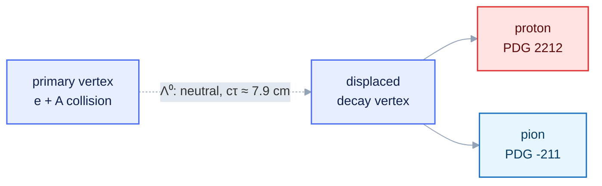

<style>
/* Mermaid: force diagram label text dark so it stays readable on the
   light node fills in BOTH light and dark mode. The Carpentries dark
   theme sets `p`/`li` color and darkens `pre` backgrounds, which would
   otherwise turn mermaid's label text light (invisible on light nodes)
   and the diagram surface dark. We override both, with !important to
   beat the theme rules and mermaid's own inline styles. */
.mermaid { background: transparent !important; }
.mermaid .nodeLabel, .mermaid .edgeLabel, .mermaid .label,
.mermaid .cluster-label, .mermaid text, .mermaid tspan,
.mermaid span, .mermaid p, .mermaid foreignObject div {
  color: #10204a !important;
  fill: #10204a !important;
}
.mermaid .edgeLabel, .mermaid .edgeLabel p, .mermaid .edgeLabel rect {
  background-color: #e2e8f0 !important;
}
</style>

::::::::::::::::::::::::::::::::::::::::::::: questions

- What is the p π⁻ invariant-mass observable, and its peak and background?
- Which EDM4eic collections and units does it need?

:::::::::::::::::::::::::::::::::::::::::::::

::::::::::::::::::::::::::::::::::::::::::::: objectives

- Explain the p π⁻ peak and its combinatorial background.
- Identify the EDM4eic collections, branches, and units.

:::::::::::::::::::::::::::::::::::::::::::::

You install an assistant and the tool servers on the [Setup](../learners/setup.md) page. This
episode is the physics you will reconstruct in [Episode 3](03-mcp-servers.md).

## The decay

The Λ⁰ is the lightest strange baryon (uds, spin-parity ½⁺). It decays only weakly (a
strangeness-changing ΔS = 1 transition), so it is long-lived: cτ ≈ 7.9 cm. Its dominant hadronic
mode is

```
Λ⁰ → p + π⁻      (branching fraction ≈ 63.9%)
```

The macroscopic lifetime makes the decay a **V0**: two oppositely charged tracks from a vertex
displaced from the primary interaction point.



### The observable

The Λ⁰ is neutral and not detected directly; we reconstruct it from its charged daughters. For a
candidate proton $p_1 = (E_1, \vec{p}_1)$ and candidate pion $p_2 = (E_2, \vec{p}_2)$, the pair's
**invariant mass** is Lorentz invariant:

$$E_i = \sqrt{|\vec{p}_i|^2 + m_i^2}$$

with $m_i$ the assigned proton or pion mass, and

$$m(p, \pi) = \sqrt{(E_1 + E_2)^2 - |\vec{p}_1 + \vec{p}_2|^2}$$

Assign the proton mass to one track and the pion mass to the other (using reconstructed particle
ID). For true Λ⁰ decays this equals the parent mass; candidates accumulate in a **peak at
1.115683 GeV**.

::::::::::::::::::::::::::::::::::::::::::::: callout

## Width: resolution, not lifetime

The Λ⁰ natural width ($\Gamma = \hbar/\tau \approx 2.5 \times 10^{-6}$ eV) is far below any detector
effect. The observed peak width — a few MeV — measures **detector momentum and angular
resolution**, not the particle.

:::::::::::::::::::::::::::::::::::::::::::::

### Background

Most proton–pion pairs share no common Λ⁰. These random ("combinatorial") pairs do not peak; they
form a smooth distribution under the signal. The analysis extracts a yield by fitting a Gaussian
peak on a low-order polynomial background ([Episode 5](05-end-to-end-agents.md)). The
charge-conjugate mode Λ̄ → p̄ π⁺ is reconstructed identically with the antiparticles.

::::::::::::::::::::::::::::::::::::::::::::: callout

## Reference values (PDG)

| Quantity | Value |
| --- | --- |
| m(Λ⁰) | 1.115683 GeV |
| m(p) | 0.9382720813 GeV |
| m(π±) | 0.13957061 GeV |
| cτ(Λ⁰) | 7.89 cm |
| BR(Λ⁰ → p π⁻) | 63.9 % |

Energies and momenta are in GeV (natural units, *c* = 1).

:::::::::::::::::::::::::::::::::::::::::::::

## The data model

ePIC reconstruction output uses **EDM4eic**, an EIC extension of EDM4hep generated with
[PODIO](../learners/reference.md). A file contains an `events` tree; each entry is one event, each
branch a **collection**. We need one collection, the reconstructed charged tracks, and four members:

```
events  (tree; one entry per event)
    ReconstructedChargedParticles.PDG          reconstructed particle-ID hypothesis
    ReconstructedChargedParticles.momentum.x   p_x  [GeV]
    ReconstructedChargedParticles.momentum.y   p_y  [GeV]
    ReconstructedChargedParticles.momentum.z   p_z  [GeV]
```

`PDG` is the Particle Data Group code the reconstruction assigns each track. Select protons
(`2212`) and π⁻ (`-211`) for Λ⁰, antiprotons (`-2212`) and π⁺ (`211`) for Λ̄.

::::::::::::::::::::::::::::::::::::::::::::: callout

## Caveat: PID is a hypothesis too

The `PDG` field is the reconstruction's best guess, not truth. Misidentification feeds the
combinatorial background — one reason a fit, not a count, is required.

:::::::::::::::::::::::::::::::::::::::::::::

You do not download a file. In [Episode 3](03-mcp-servers.md) the assistant uses the **rucio** tools
to find a DIS dataset and **xrootd** to verify its files, then reads one of the dataset's `root://`
URLs (e.g. `root://dtn-eic.jlab.org//...`) **in place** with the **uproot** tools — pulling exactly
these branches without writing any I/O code.

::::::::::::::::::::::::::::::::::::::::::::: keypoints

- The observable is the p π⁻ invariant mass; the Λ⁰ appears as a narrow peak over a combinatorial background.
- The peak width is set by detector resolution, not the negligible Λ⁰ natural width.
- The data are EDM4eic collections in an `events` tree; momenta are in GeV.

:::::::::::::::::::::::::::::::::::::::::::::
