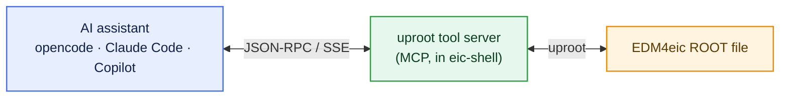
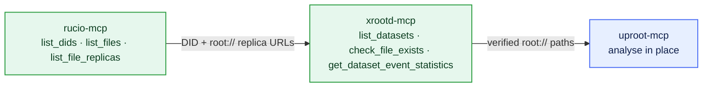

::::::::::::::::::::::::::::::::::::::::::::: questions

- What is MCP, and what interoperability problem does it solve?
- What does the uproot tool server expose, and how is its execution made safe?
- How is one server connected to different assistants, and how do I drive it?

:::::::::::::::::::::::::::::::::::::::::::::

::::::::::::::::::::::::::::::::::::::::::::: objectives

- Describe MCP as a client–server protocol that decouples tools from assistants.
- Enumerate the categories of tool the uproot server provides and the constraints on `execute_kernel`.
- Start the servers with `eic-mcp up`, connect opencode over SSE, and confirm the connection.
- Direct the assistant to locate a dataset, inspect it, and histogram a branch, then verify the result.

:::::::::::::::::::::::::::::::::::::::::::::

## The interoperability problem

In [Episode 1](01-why-genai-for-physics.md) we identified tools as the only channel through which
an assistant acts. Historically, each assistant required bespoke integrations for each data
source — an N×M problem. The **Model Context Protocol (MCP)** removes it by standardising the
interface: a tool is implemented once, as a **server**, and any MCP-compliant **client** (the
assistant) can use it.

MCP is a client–server protocol built on **JSON-RPC 2.0**. After an initial capability
negotiation, the server advertises three kinds of object — **tools** (callable functions),
**resources** (readable data), and **prompts** (templated instructions). It runs over two
transports: **stdio**, where the client launches the server as a subprocess and exchanges messages
on standard input/output, and streamable **HTTP/SSE** for networked servers. The servers in this
lesson run inside eic-shell and speak SSE, so the assistant connects to them over a URL.



::::::::::::::::::::::::::::::::::::::::::::: callout

## Why run the servers inside eic-shell

The servers reuse the container's own `uproot`, `xrdfs`, and `rucio`, so their dependencies are
already pinned and the same environment that runs your analysis runs the tools — which matters for
reproducibility. `eic-mcp up` starts them as background processes serving SSE on local ports, and
`eic-mcp down` stops them; they hold no long-lived state between sessions.

:::::::::::::::::::::::::::::::::::::::::::::

## The uproot tool server

The ePIC [uproot tool server](https://github.com/eic/uproot-mcp-server) reads ROOT/EDM4eic files
with [uproot](../learners/reference.md) and returns **compact, JSON-serialisable summaries** —
edges, counts, statistics, fit inputs — rather than raw arrays. Returning reduced quantities is
deliberate: it keeps payloads inside the model's context budget and keeps results easy to check. It
exposes 15 tools in four groups:

| Group | Representative tools | Purpose |
| --- | --- | --- |
| Inspection | `get_file_structure`, `get_tree_info`, `get_branch_statistics`, `validate_dataset_schema` | enumerate trees, branches, types, and summary statistics |
| Single-file compute | `histogram_branch`, `execute_kernel` | histogram a branch; run sandboxed NumPy/awkward over branches |
| Dataset (multi-file) | `get_dataset_file_list`, `histogram_dataset`, `get_dataset_statistics`, `execute_kernel_dataset`, `estimate_dataset_cost` | enumerate matching files, then accumulate the same operations across them |
| Asynchronous jobs | `submit_kernel_dataset`, `get_job_status`, `get_job_result`, `cancel_job` | dispatch long dataset jobs and poll them |

::::::::::::::::::::::::::::::::::::::::::::: callout

## The execution sandbox

`execute_kernel` runs Python supplied by the client, so it executes in a restricted environment:
no `import`, no file or network I/O, and only `np` (NumPy) and `ak` (awkward) in scope, enforced
at compile time and run in a subprocess with a 30-second wall-clock limit. This boundary is what
makes it defensible to let a model author code that runs against your data.

:::::::::::::::::::::::::::::::::::::::::::::

## Start the servers

The three servers were built once at [Setup](../learners/setup.md) (`eic-mcp setup`). Start them
for this session from inside eic-shell:

```bash
$ eic-mcp up
```

This launches the uproot, xrootd, and rucio servers as SSE endpoints on `127.0.0.1` — ports
`9101`, `9102`, and `9103` respectively. Stop them again at the end with `eic-mcp down`. You do
not launch the tools by hand; the assistant connects to those URLs.

## Connect the assistant

opencode reads its server list from a JSON config; the ready-made
[`files/mcp-config/opencode.jsonc`](https://github.com/aprozo/tutorial-mcp/blob/main/files/mcp-config/opencode.jsonc)
points it at the three SSE URLs:

```json
{
  "mcp": {
    "rucio":  { "type": "remote", "url": "http://127.0.0.1:9103/sse", "enabled": true },
    "xrootd": { "type": "remote", "url": "http://127.0.0.1:9102/sse", "enabled": true },
    "uproot": { "type": "remote", "url": "http://127.0.0.1:9101/sse", "enabled": true }
  }
}
```

Copy it to the directory where you launch opencode (or to `~/.config/opencode/`). Within a session,
`/mcp` lists the connected servers and their tools.

::::::::::::::: callout

## Other clients point at the same URLs

The SSE endpoints are not opencode-specific. Any MCP client registers them the same way — for
example Claude Code: `claude mcp add --transport sse uproot http://127.0.0.1:9101/sse` (and likewise
for `xrootd` and `rucio`), and GitHub Copilot reads the equivalent SSE URLs from its own config.

:::::::::::::::

## Finding the data with MCP

You do not fetch any dataset by hand. The other two MCP servers let the assistant locate and verify
the real files for you, replacing the manual `rucio` + `xrdfs` recipe — and `uproot-mcp` then reads
the file straight from the store, with no download step at all.



* **[`rucio-mcp`](https://github.com/eic/rucio-eic-mcp-server)** queries the data-management catalogue:
  `list_dids` finds the dataset's identifier (DID) by name, `get_did_metadata` and `list_files`
  describe its contents, and `list_file_replicas` returns the physical `root://` locations.
* **`xrootd-mcp`** (started by `eic-mcp up` alongside the others) works directly on the store:
  `list_campaigns` / `list_datasets` browse it, `list_directory` and `check_file_exists` enumerate
  and verify files, and `get_dataset_event_statistics` reports the total events across a dataset.

The two compose: rucio tells you *what* the dataset is and *where* its replicas live, xrootd confirms
the files are really there, and `uproot-mcp` then reads a `root://` URL **in place** — no download
step at all.

::::::::::::::::::::::::::::::::::::::::::::: callout

## rucio works automatically — no key

`rucio-mcp` talks to an authenticated catalogue, but inside eic-shell it signs in for you with the
shared, read-only `eicread` account — the same one the `rucio` command line uses. You never enter a
password or a grid proxy. The xrootd path is public too, so if you only want to *browse* the store
you can use `xrootd-mcp` alone.

:::::::::::::::::::::::::::::::::::::::::::::

::::::::::::::::::::::::::::::::::::::::::::: challenge

## Exercise: locate a dataset (≈ 10 min)

With `rucio` and `xrootd` connected (no credentials needed — see the callout above), ask your
assistant:

```
Use the rucio tools to find the ePIC reconstructed-DIS dataset for the BeAGLE eCu 10x115 GeV sample in campaign 25.10.2, list its files, then use the xrootd tools to confirm those files exist on the store and report the total number of events.
```

::::::::::::::: solution

The assistant calls `list_scopes`/`list_dids` (scope `epic`, narrowing by a name glob on the
campaign and beam/target) to find the dataset DID, `list_files` to enumerate it, and
`list_file_replicas` for the `root://` URLs. It then switches to `xrootd-mcp`
(`list_datasets`, `check_file_exists`, `get_dataset_event_statistics`) to verify the files and
total the events. The DID is *discovered* with `list_dids`, not hard-coded — exactly what you
want when campaign names change.

:::::::::::::::

:::::::::::::::::::::::::::::::::::::::::::::

## Inspect the dataset

With the server connected, you specify the operation in natural language and the assistant issues
the corresponding tool calls. Take one of the `root://` URLs the previous exercise found — written
below as `root://dtn-eic.jlab.org//…` — and analyse it **in place**, with no download.

::::::::::::::::::::::::::::::::::::::::::::: challenge

## Exercise: enumerate the schema (≈ 10 min)

Issue the request:

```
Using the uproot tools, report the structure of root://dtn-eic.jlab.org//<your-discovered-file>.root and list the members of the ReconstructedChargedParticles collection.
```

::::::::::::::: solution

The assistant calls `get_file_structure` (returning the `events` tree) followed by
`get_tree_info`, and reports something like:

```output
File:  root://dtn-eic.jlab.org//…/<dataset-file>.root
Tree:  events   — branches grouped by collection

ReconstructedChargedParticles collection:
  ReconstructedChargedParticles.PDG          int32[]   PDG particle-ID code
  ReconstructedChargedParticles.momentum.x   float[]   p_x [GeV]
  ReconstructedChargedParticles.momentum.y   float[]   p_y [GeV]
  ReconstructedChargedParticles.momentum.z   float[]   p_z [GeV]
(each member has a companion nReconstructedChargedParticles.* count branch)
```

The names are read from the file, not inferred — eliminating the schema-hallucination failure
mode from Episode 1.

:::::::::::::::

:::::::::::::::::::::::::::::::::::::::::::::

::::::::::::::::::::::::::::::::::::::::::::: challenge

## Exercise: identify the species present (≈ 10 min)

Issue the request:

```
Histogram ReconstructedChargedParticles.PDG so I can see the reconstructed particle species in the file.
```

::::::::::::::: solution

The assistant calls `histogram_branch`. The distribution is discrete — spikes at the PDG codes
present. Counting them over a reconstructed-DIS file gives, for example:

```output
   PDG  species   count
  -211   pi-      11447
   211   pi+       9885
    11   e-        4489
     0   unID      2971      <- tracks with no PID hypothesis
  -321   K-        1662
   321   K+        1588
   -11   e+         967
 -2212   pbar       693
  2212   p          684      <- protons are rare
```

{alt='Bar histogram of reconstructed charged-particle PDG codes in the file, with pions dominating and protons rare'}

Two things to note. Pions dominate; **protons are rare** (≈ 2%), so the Λ⁰ signal will be small.
And a sizeable fraction of tracks carry **no PID** (code 0) or a wrong one — misidentification
that feeds the combinatorial background and is why we *fit* the peak rather than count it.

:::::::::::::::

:::::::::::::::::::::::::::::::::::::::::::::

::::::::::::::::::::::::::::::::::::::::::::: callout

## Verify the returned quantities

The tools return numbers — bin edges, counts, statistics. Inspect them: do the PDG peaks fall at
physical codes, and are the proton and pion yields plausible? This is the verification step from
Episode 1 applied in practice; it is formalised as explicit success criteria in
[Episode 4](04-skills.md).

:::::::::::::::::::::::::::::::::::::::::::::

## One data model, several access paths

ePIC data follow the **PODIO** model (EDM4eic): an `events` tree whose branches are per-event
collections such as `ReconstructedChargedParticles` and `MCParticles`. We read it with **uproot**
because that needs only eic-shell — no compiled framework. uproot is, however, only one of
several equivalent access paths.

::::::::::::::::::::::::::::::::::::::::::::: callout

## Equivalent implementations

This lesson reads EDM4eic with **uproot** through MCP. The same Λ⁰ peak is obtained with:

* **ROOT RDataFrame** — declarative, columnar, parallel;
* **ROOT TTreeReader** — an explicit event loop;
* **bare uproot** — Python with no tool server; and
* **the PODIO Frame API** — the native interface.

Worked implementations of each, all reproducing the same result, are in
[Alternative analysis approaches](../learners/analysis-approaches.md).

:::::::::::::::::::::::::::::::::::::::::::::

The assistant can now query the data through a verifiable interface. In the next episode we
capture this procedure as a reusable, versioned **skill**.

::::::::::::::::::::::::::::::::::::::::::::: keypoints

- MCP is a JSON-RPC client–server protocol; a server exposes tools, resources, and prompts to any compliant client.
- The uproot server returns compact, JSON-serialisable summaries rather than raw arrays, which keeps results inspectable.
- `execute_kernel` runs client-supplied Python in a restricted sandbox: no imports or I/O, only NumPy/awkward, with a timeout.
- The servers run inside eic-shell (`eic-mcp up`) and speak SSE; opencode and other clients connect to the same `127.0.0.1` URLs.
- PODIO/uproot is one access path; RDataFrame, TTreeReader, and bare uproot give the same result (see the extras).

:::::::::::::::::::::::::::::::::::::::::::::
