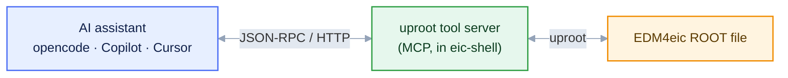
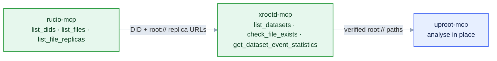
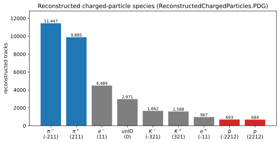

<style>
/* Mermaid: force diagram label text dark so it stays readable on the
   light node fills in BOTH light and dark mode. The Carpentries dark
   theme sets `p`/`li` color and darkens `pre` backgrounds, which would
   otherwise turn mermaid's label text light (invisible on light nodes)
   and the diagram surface dark. We override both, with !important to
   beat the theme rules and mermaid's own inline styles. */
.mermaid { background: transparent !important; }
/* Hide the Workbench "Diagram source code" spoiler under each diagram */
.mermaid-img-wrapper details { display: none !important; }
.mermaid .nodeLabel, .mermaid .edgeLabel, .mermaid .label,
.mermaid .cluster-label, .mermaid text, .mermaid tspan,
.mermaid span, .mermaid p, .mermaid foreignObject div {
  color: #10204a !important;
  fill: #10204a !important;
}
.mermaid .edgeLabel, .mermaid .edgeLabel p, .mermaid .edgeLabel rect {
  background-color: #e2e8f0 !important;
}
/* AI prompts: paste-into-your-assistant blocks. Styled like a normal
   code block (same neutral pre background/border as python etc.), with
   just a small "AI Prompt" tag in the corner. */
pre.ai-prompt, div.sourceCode.ai-prompt {
  border-top: 10px solid #7c3aed;
}
pre.ai-prompt, pre.ai-prompt code {
  white-space: pre-wrap;       /* wrap long prompts onto many lines */
  overflow-wrap: anywhere;
}
pre.ai-prompt::before, div.sourceCode.ai-prompt::before {
  content: "AI Prompt";
  display: block;
  margin-bottom: .5rem;
  font-weight: 600;
  font-size: .78em;
  letter-spacing: .03em;
  text-transform: uppercase;
  color: #7c3aed;
}
</style>

::::::::::::::::::::::::::::::::::::::::::::: questions

- What is MCP, and what problem does it solve?
- What does the uproot server expose, and how is it sandboxed?
- How do you connect and drive a server?

:::::::::::::::::::::::::::::::::::::::::::::

::::::::::::::::::::::::::::::::::::::::::::: objectives

- Bring the servers up, check them, and read a log when one misbehaves (`eic-mcp up`/`status`/`logs`).
- Generate the connection file for your own client with `eic-mcp config`.
- Discover a real DIS dataset by prompting, without hard-coding names or paths.
- Judge which returned quantities are worth verifying, and against what.

:::::::::::::::::::::::::::::::::::::::::::::

## The interoperability problem

Tools are the only channel through which an assistant acts
([Episode 1](01-why-genai-for-physics.md)). The
**Model Context Protocol (MCP)** standardises the interface: implement a tool once as a **server**,
and any MCP-compliant **client** (the assistant) can use it.

MCP is a client–server protocol over **JSON-RPC 2.0**. After capability negotiation, the server
advertises three object types — **tools** (callable functions), **resources** (readable data), and
**prompts** (templated instructions). Two transports exist: **stdio** (client launches the server as
a subprocess, messages over standard input/output) and **streamable HTTP** for networked servers.
The lesson's servers run inside eic-shell and speak streamable HTTP on `127.0.0.1`.



::::::::::::::::::::::::::::::::::::::::::::: callout

## Why run the servers inside eic-shell

The servers reuse the container's own `uproot`, `xrdfs`, and `rucio`, so dependencies are pinned and
one environment runs both analysis and tools. `eic-mcp up` starts them as background HTTP services;
`eic-mcp down` stops them. They hold no state between sessions.

:::::::::::::::::::::::::::::::::::::::::::::

## The uproot tool server

The ePIC [uproot tool server](https://github.com/eic/uproot-mcp-server) reads ROOT/EDM4eic files
with [uproot](../learners/reference.md) and returns **JSON summaries** — edges, counts, statistics,
fit inputs — not raw arrays. One caveat: `get_file_structure` on an EDM4eic file lists all ~6,000
branches (megabytes of JSON); for schema questions `get_tree_info` is the compact choice.
It exposes 15 tools in four groups:

| Group | Representative tools | Purpose |
| --- | --- | --- |
| Inspection | `get_file_structure`, `get_tree_info`, `get_branch_statistics`, `validate_dataset_schema` | enumerate trees, branches, types, and summary statistics |
| Single-file compute | `histogram_branch`, `execute_kernel` | histogram a branch; run sandboxed NumPy/awkward over branches |
| Dataset (multi-file) | `get_dataset_file_list`, `histogram_dataset`, `get_dataset_statistics`, `execute_kernel_dataset`, `estimate_dataset_cost` | enumerate matching files, then accumulate operations across them |
| Asynchronous jobs | `submit_kernel_dataset`, `get_job_status`, `get_job_result`, `cancel_job` | dispatch long dataset jobs and poll them |

::::::::::::::::::::::::::::::::::::::::::::: callout

## The execution sandbox

`execute_kernel` runs client-supplied Python in a restricted environment: no `import`, no file or
network I/O, only `np` (NumPy) and `ak` (awkward) in scope. Limits are enforced at compile time, and
the code runs in a subprocess with a 30-second wall-clock limit.

:::::::::::::::::::::::::::::::::::::::::::::

## Start the servers

Start the servers for this session from inside eic-shell (the first `eic-mcp up` ever run
bootstraps them automatically if your image doesn't ship them yet — see
[Setup](../learners/setup.md)):

```bash
$ eic-mcp up
```

This launches the uproot, xrootd, and rucio servers as MCP-over-HTTP endpoints on `127.0.0.1`,
ports `9101`, `9102`, `9103`. Stop them with `eic-mcp down`. The assistant connects to those URLs.

::::::::::::::: callout

## If rucio answers but xrootd/uproot time out

The rucio catalogue and the data store are different services. If dataset queries work but every
file access hangs, the XRootD store may be temporarily down — check with
`xrdfs root://epicxrd1.sdcc.bnl.gov:1095 ls /eic/EPIC/RECO` (inside eic-shell) and retry later.
Your setup is fine; the store isn't answering.

Current campaigns (25.12.0 onward) are served from BNL disk, which is what `eic-mcp` points the
xrootd server at by default. Older campaigns (up to 25.10.x) live on the JLab store instead —
browse those with `XROOTD_SERVER=root://dtn-eic.jlab.org XROOTD_BASE_DIR=/volatile/eic/EPIC
eic-mcp up`. Either way, `rucio` replicas always tell you where a file really is.

:::::::::::::::

## Connect the assistant

opencode reads its server list from a JSON config. Generate it in the directory where you launch
opencode (or write it to `~/.config/opencode/opencode.jsonc`):

```bash
$ eic-mcp config opencode > opencode.jsonc
```

which prints the three server URLs
(committed as the example [`files/mcp-config/opencode.jsonc`](https://github.com/eic/tutorial-mcp/blob/main/files/mcp-config/opencode.jsonc)):

```json
{
  "mcp": {
    "uproot": { "type": "remote", "url": "http://127.0.0.1:9101/mcp", "enabled": true },
    "xrootd": { "type": "remote", "url": "http://127.0.0.1:9102/mcp", "enabled": true },
    "rucio":  { "type": "remote", "url": "http://127.0.0.1:9103/mcp", "enabled": true }
  }
}
```

Within a session, `/mcp` lists the connected servers and their tools.

::::::::::::::: callout

## Other clients point at the same URLs

The HTTP endpoints work with any MCP client, and `eic-mcp config` writes the matching file:

```bash
$ eic-mcp config copilot > .vscode/mcp.json      # VS Code / Copilot
$ eic-mcp config cursor  > .cursor/mcp.json      # Cursor
$ eic-mcp config claude  > .mcp.json             # Claude Code
$ eic-mcp config gemini  > .gemini/settings.json # Gemini CLI
$ eic-mcp config codex  >> ~/.codex/config.toml  # Codex (TOML, appended)
```

:::::::::::::::

::::::::::::::: callout

## Running the client outside the container

The MCP servers always run *inside* eic-shell, but your AI client doesn't have to.

* **Linux and Windows/WSL:** eic-shell uses Apptainer/Singularity, which shares the host network.
  The `http://127.0.0.1:910x/mcp` URLs work identically from inside the container and from the
  host — install your client on the host, run `eic-mcp config <client>` (the launcher finds your
  eic_xl image automatically), and connect.
* **macOS:** your `./eic-shell` script runs Docker under the hood, and it publishes no ports, so
  the endpoints are *not* reachable from the host by default. Simplest fix: run the client inside
  eic-shell (opencode is a terminal program and installs fine in the container). Otherwise, either
  open the `eic-shell` script the installer generated and add
  `-p 127.0.0.1:9101-9104:9101-9104` to its `docker run` line, or start the container with the
  full command yourself (this is what `./eic-shell` runs, plus the port flag):

  ```bash
  docker run --platform linux/amd64 -p 127.0.0.1:9101-9104:9101-9104 \
    -v /Users:/Users -v /Volumes:/Volumes -v /tmp:/tmp -w=$PWD -it --rm \
    -e EIC_SHELL_PREFIX=$PWD/local eicweb/eic_xl:nightly eic-shell
  ```

:::::::::::::::

## Finding the data with MCP

You fetch no dataset by hand. The other two MCP servers let the assistant locate and verify the real
files, replacing the manual `rucio` + `xrdfs` recipe; `uproot-mcp` reads the file straight from the
store, with no download step.



* **[`rucio-mcp`](https://github.com/eic/rucio-eic-mcp-server)** queries the data-management catalogue:
  `list_dids` finds the dataset identifier (DID) by name, `get_did_metadata` and `list_files`
  describe its contents, `list_file_replicas` returns the physical `root://` locations.
* **[`xrootd-mcp`](https://github.com/eic/xrootd-mcp-server)** works directly on the store: `list_campaigns` / `list_datasets` browse it,
  `list_directory` and `check_file_exists` enumerate and verify files, and
  `get_dataset_event_statistics` reports total events across a dataset.

rucio tells you *what* the dataset is and *where* its replicas live, xrootd confirms the files are
there, and `uproot-mcp` reads a `root://` URL **in place**.

::::::::::::::::::::::::::::::::::::::::::::: callout

## rucio works automatically — no key

Inside eic-shell, `rucio-mcp` signs in to the authenticated catalogue with the shared, read-only
`eicread` account. No password or grid proxy. The xrootd path is public, so to only *browse* the
store you can use `xrootd-mcp` alone.

:::::::::::::::::::::::::::::::::::::::::::::

## List the available campaigns

ePIC data is organised by **production campaign** — a version such as `26.06.0` — together with the
beam/target and physics, all encoded in the rucio DID
(e.g. `epic:/RECO/26.06.0/epic_craterlake/DIS/pythia8.316-1.0/NC/noRad/ep/18x275/...`). Before
locating a specific dataset, see which campaigns exist so you target a current one:

```{.ai-prompt}
Using the rucio tools, list the DIDs in the epic scope and summarise which production campaigns are available (the version field, e.g. 26.06.0). Show the most recent few and roughly how many datasets each holds.
```

The assistant calls [`list_dids`](https://github.com/eic/rucio-eic-mcp-server) on scope `epic` and
groups the DIDs by their campaign component. Watch its method here: the catalogue holds thousands
of DIDs and pages are not sorted newest-first, so a lazy one-page sample can miss the current
campaigns entirely. Narrowing with a version wildcard (`/RECO/26.*`) — or one call to the `xrootd`
server's `list_campaigns` — gets the honest answer.

::::::::::::::::::::::::::::::::::::::::::::: challenge

## Exercise: locate a dataset (≈ 10 min)

With `rucio` and `xrootd` connected (no credentials — see the callout), ask your assistant:

```{.ai-prompt}
Use the rucio tools to find the ePIC reconstructed-DIS dataset for the BeAGLE eCu 10x115 GeV sample in campaign 26.04.1, list its files, then use the xrootd tools to confirm those files exist on the store and report the total number of events.
```

::::::::::::::: solution

The assistant calls `list_scopes`/`list_dids` (scope `epic`, narrowing by a name glob on the
campaign and beam/target) to find the DID, `list_files` to enumerate it (374 files), and
`list_file_replicas` for the `root://` URLs. It then switches to `xrootd-mcp`
(`list_directory_filtered`, `check_file_exists`) to verify the files. For the event total, note
what a sensible assistant does: rucio does not carry event counts, and scanning all 374 files
would take an hour — it checks a few files (≈ 1,220 events each) and extrapolates. The DID is
*discovered* with `list_dids`, not hard-coded — what you want when campaign names change.

:::::::::::::::

:::::::::::::::::::::::::::::::::::::::::::::

## Inspect the dataset

You specify the operation in natural language and the assistant issues the matching tool calls. Take
one of the `root://` URLs from the previous exercise — written below as `root://epicxrd1.sdcc.bnl.gov:1095//…`
— and analyse it **in place**.

::::::::::::::::::::::::::::::::::::::::::::: challenge

## Exercise: enumerate the schema (≈ 10 min)

Issue the request:

```{.ai-prompt}
Using the uproot tools, report the structure of root://epicxrd1.sdcc.bnl.gov:1095//<your-discovered-file>.root and list the members of the ReconstructedChargedParticles collection.
```

::::::::::::::: solution

The assistant calls `get_tree_info` on the `events` tree (not the full `get_file_structure` dump,
which runs to megabytes on an EDM4eic file) and reports something like:

```output
File:  root://epicxrd1.sdcc.bnl.gov:1095//…/<dataset-file>.root
Tree:  events   — branches grouped by collection

ReconstructedChargedParticles collection:
  ReconstructedChargedParticles.PDG          int32[]   PDG particle-ID code
  ReconstructedChargedParticles.momentum.x   float[]   p_x [GeV]
  ReconstructedChargedParticles.momentum.y   float[]   p_y [GeV]
  ReconstructedChargedParticles.momentum.z   float[]   p_z [GeV]
  … energy, charge, mass, type, referencePoint.*, covMatrix.*
```

The names are read from the file, not inferred — eliminating the schema-hallucination failure mode
from Episode 1. These *are* the branches you're looking for.

:::::::::::::::

:::::::::::::::::::::::::::::::::::::::::::::

::::::::::::::::::::::::::::::::::::::::::::: challenge

## Exercise: identify the species present (≈ 10 min)

Issue the request:

```{.ai-prompt}
Histogram ReconstructedChargedParticles.PDG with one bin per integer code, so I can see the reconstructed particle species in the file.
```

::::::::::::::: solution

The assistant calls `histogram_branch`, setting the bins and range so each integer code gets its
own bin (the default auto-binning would merge neighbouring codes, e.g. 0 and 11). The distribution
is discrete — spikes at the PDG codes present. Counting over a reconstructed-DIS file gives, for
example:

```output
   PDG  species   count
  -211   pi-      11447
   211   pi+       9885
    11   e-        4489
     0   unID      2971      <- tracks with no PID hypothesis
  -321   K-        1662
   321   K+        1588
   -11   e+         967
 -2212   pbar       693
  2212   p          684      <- protons are rare
```

{alt='Bar histogram of reconstructed charged-particle PDG codes in the file, with pions dominating and protons rare'}

Pions dominate; **protons are rare** (≈ 2%), so the Λ⁰ signal will be small. A sizeable fraction of
tracks carry **no PID** (code 0) or a wrong one — misidentification that feeds the combinatorial
background and is why we *fit* the peak rather than count it.

:::::::::::::::

:::::::::::::::::::::::::::::::::::::::::::::

::::::::::::::::::::::::::::::::::::::::::::: callout

## Verify the returned quantities

Inspect the returned numbers — bin edges, counts, statistics: do the PDG peaks fall at physical
codes, and are the proton and pion yields plausible? [Episode 4](04-skills.md) formalises this as
explicit success criteria.

:::::::::::::::::::::::::::::::::::::::::::::

## One data model, several access paths

ePIC data follow the **PODIO** model (EDM4eic): an `events` tree whose branches are per-event
collections such as `ReconstructedChargedParticles` and `MCParticles`. We read it with **uproot**
because that needs only eic-shell — no compiled framework. uproot is one of several equivalent access
paths.

::::::::::::::::::::::::::::::::::::::::::::: callout

## Equivalent implementations

The same Λ⁰ peak comes out of:

* **ROOT RDataFrame** — declarative, columnar, parallel;
* **ROOT TTreeReader** — an explicit event loop;
* **bare uproot** — Python with no tool server; and
* **the PODIO Frame API** — the native interface.

Worked implementations of each are in
[Alternative analysis approaches](../learners/analysis-approaches.md).

:::::::::::::::::::::::::::::::::::::::::::::

The assistant can now query the data through a verifiable interface. The next episode captures this
procedure as a reusable, versioned **skill**.

::::::::::::::::::::::::::::::::::::::::::::: keypoints

- MCP is a JSON-RPC client–server protocol; a server exposes tools, resources, and prompts to any compliant client.
- The uproot server returns compact, JSON-serialisable summaries rather than raw arrays, which keeps results inspectable.
- `execute_kernel` runs client-supplied Python in a restricted sandbox: no imports or I/O, only NumPy/awkward, with a timeout.
- The servers run inside eic-shell (`eic-mcp up`) and speak streamable HTTP; opencode and other clients connect to the same `127.0.0.1` URLs (`eic-mcp config <client>`).
- PODIO/uproot is one access path; RDataFrame, TTreeReader, and bare uproot give the same result (see the extras).

:::::::::::::::::::::::::::::::::::::::::::::
