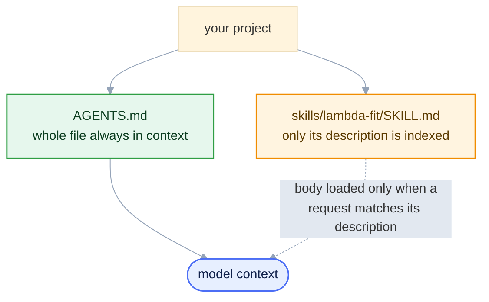

<style>
/* Mermaid: force diagram label text dark so it stays readable on the
   light node fills in BOTH light and dark mode. The Carpentries dark
   theme sets `p`/`li` color and darkens `pre` backgrounds, which would
   otherwise turn mermaid's label text light (invisible on light nodes)
   and the diagram surface dark. We override both, with !important to
   beat the theme rules and mermaid's own inline styles. */
.mermaid { background: transparent !important; }
/* Hide the Workbench "Diagram source code" spoiler under each diagram */
.mermaid-img-wrapper details { display: none !important; }
.mermaid .nodeLabel, .mermaid .edgeLabel, .mermaid .label,
.mermaid .cluster-label, .mermaid text, .mermaid tspan,
.mermaid span, .mermaid p, .mermaid foreignObject div {
  color: #10204a !important;
  fill: #10204a !important;
}
.mermaid .edgeLabel, .mermaid .edgeLabel p, .mermaid .edgeLabel rect {
  background-color: #e2e8f0 !important;
}
/* AI prompts: paste-into-your-assistant blocks. Styled like a normal
   code block (same neutral pre background/border as python etc.), with
   just a small "AI Prompt" tag in the corner. */
pre.ai-prompt, div.sourceCode.ai-prompt {
  border-top: 10px solid #7c3aed;
}
pre.ai-prompt, pre.ai-prompt code {
  white-space: pre-wrap;       /* wrap long prompts onto many lines */
  overflow-wrap: anywhere;
}
pre.ai-prompt::before, div.sourceCode.ai-prompt::before {
  content: "AI Prompt";
  display: block;
  margin-bottom: .5rem;
  font-weight: 600;
  font-size: .78em;
  letter-spacing: .03em;
  text-transform: uppercase;
  color: #7c3aed;
}
</style>

::::::::::::::::::::::::::::::::::::::::::::: questions

- How do you give an assistant durable project context?
- AGENTS.md vs SKILL.md — when to use each?
- How do you make every tool read the same rules?
- What's in a usable SKILL.md for the Λ⁰ fit?

:::::::::::::::::::::::::::::::::::::::::::::

::::::::::::::::::::::::::::::::::::::::::::: objectives

- Write an AGENTS.md for always-on project context.
- Bridge it so one AGENTS.md drives any tool.
- Write a SKILL.md that runs the Λ⁰ fit on demand.
- Encode success criteria + provenance for auditable output.

:::::::::::::::::::::::::::::::::::::::::::::

## Two ways to make instructions persistent

Typing requests (Episode 3) does not scale: you re-explain the data model, conventions, and procedure every session, and nothing stops two runs from diverging. Two file-based mechanisms fix this.

* **`AGENTS.md`** — always-on **context**, read at the start of every session: environment, data model, conventions, and what "done" means.
* **`SKILL.md`** — an on-demand **procedure** in a named skill directory, loaded only when a request matches its description. It encodes one repeatable workflow.



`AGENTS.md` answers "what is this project and how do we work here?"; a `SKILL.md` answers "how do I carry out *this* task?".

## AGENTS.md — project context

`AGENTS.md` is plain Markdown at your project root (subdirectories may override it for files beneath them). opencode, Codex, Gemini CLI, Zed, and others read it automatically; where a tool uses a different name (Copilot's `copilot-instructions.md`, Cursor's `.cursorrules`), the content transfers unchanged.

It is loaded on every turn, so keep it short and factual:

```markdown
# AGENTS.md — Lambda analysis project

## What this project does
Reconstruct Lambda0 -> p pi- in ePIC EDM4eic data and fit the invariant-mass
peak near 1.115683 GeV.

## Environment
- Everything runs inside eic-shell; the MCP servers are started with `eic-mcp up`.
- Data lives on the grid: find a DIS dataset with the `rucio` tools and read its
  root:// files in place with `uproot` — no download.

## Tools
- Use the `rucio` MCP server (list_dids, list_files, list_file_replicas) to locate
  a dataset and resolve its root:// URLs.
- Use the `xrootd` MCP server (check_file_exists, get_file_info) to verify a file.
- Use the `uproot` MCP server (get_file_structure, get_tree_info, histogram_branch,
  execute_kernel, execute_kernel_dataset) for all ROOT file access.
- Do NOT write bespoke file I/O; the servers already handle it.

## Data model
- Tree: events.  Collection: ReconstructedChargedParticles.
- Members: .PDG, .momentum.x, .momentum.y, .momentum.z   (momenta in GeV).
- PDG codes: proton 2212, pi- -211, antiproton -2212, pi+ 211.

## Physics constants (PDG)
- m(proton) = 0.9382720813 GeV, m(pi) = 0.13957061 GeV, m(Lambda) = 1.115683 GeV.

## Conventions
- Invariant mass over [1.05, 1.25] GeV, 200 bins.
- Fit a Gaussian + 2nd-order polynomial over [1.08, 1.16] GeV.
- Write results as JSON; save plots under output/.

## Definition of done
- Fitted peak within a few MeV of 1.115683 GeV and chi2/ndf of order 1.
- Always run the fit and check these before reporting a result.
```

This encodes the schema, the tool policy (use the server, not hand-written I/O), the conventions, and an explicit definition of done.

::::::::::::::::::::::::::::::::::::::::::::: callout

## Two rules for a useful AGENTS.md

* **Keep it short.** It is loaded on every turn, so length costs tokens and dilutes attention. Write only what the model cannot infer from the code.
* **Describe concepts, not file paths.** "The reconstructed tracks are in the `ReconstructedChargedParticles` collection" ages well; a path like `src/old/lambda_v2.py` does not — paths move, and the model then searches confidently in the wrong place.

:::::::::::::::::::::::::::::::::::::::::::::

## One source of truth: bridge files

Not every tool reads `AGENTS.md`. Most modern ones do — opencode, Codex, Gemini CLI, Zed — but some look for their own filename and silently ignore it: GitHub Copilot reads `copilot-instructions.md`, Cursor reads `.cursorrules`. A project with only an `AGENTS.md` runs such a tool with no context and no warning.

Don't copy your rules into a second file; two copies drift within a week. **Keep the standard in the centre and let each tool read from it**: the tool-specific file becomes a one-line *bridge* pointing at `AGENTS.md`.

`.github/copilot-instructions.md` (GitHub Copilot) — and `.cursorrules` (Cursor) — are one line:

```markdown
Follow the project rules in AGENTS.md.
```

Now every assistant reads the same source of truth. Copy the ready-made bridge: [`copilot-instructions.md`](https://github.com/eic/tutorial-mcp/blob/main/files/skills/copilot-instructions.md).

## SKILL.md — a named procedure

A **skill** is a directory containing a `SKILL.md` that describes a repeatable procedure:

```bash
skills/
  lambda-fit/
    SKILL.md              specification: applicability, inputs, steps, success criteria
```

The procedure runs by driving the MCP tools (build the histogram with the uproot kernel, fit the Gaussian + polynomial in the same sandbox), so it needs no bundled scripts.

The YAML frontmatter carries a `name` and a `description`. The `description` is load-bearing: the client matches the request against it to decide whether to load the skill. **Only the name and description stay in context** — the body is read in *only when* the description matches.

```markdown
---
name: lambda-fit
description: >
  Reconstruct and fit the Lambda0 -> p pi- invariant-mass peak in ePIC EDM4eic
  data. Use when asked to measure the Lambda yield, mass, or width, or to
  reproduce the Lambda peak from a .root file or a file list.
---

# Lambda invariant-mass fit

## When to use
Any request to find, fit, or quantify the Lambda0 (or its antiparticle) in ePIC
reconstructed data via the proton-pion invariant mass.

## Inputs
- file: one EDM4eic .root URL (a root:// file from a DIS dataset), or
- file_list: the dataset's root:// files for the full sample
  (resolve both with the rucio tools: list_dids, list_files, list_file_replicas).

## Steps
1. Confirm the uproot MCP server is connected: get_tree_info on the input.
2. Build the proton-pion invariant-mass histogram with execute_kernel (one file)
   or execute_kernel_dataset (many files), tree_name 'events' and the
   ReconstructedChargedParticles momentum/PDG branches. For a large sample, cap
   the file count first; for more than ~10 files use submit_kernel_dataset and
   poll, so no single tool call outlives the client's timeout. Write any
   reduce/merge code as plain NumPy array operations (the sandbox rejects tuple
   unpacking in loops).
3. Fit the histogram with a second execute_kernel call (Gaussian + 2nd-order
   polynomial over [1.08, 1.16] GeV; NumPy/awkward only, no imports).
4. Report mu, sigma, signal yield S, and chi2/ndf.

## Success criteria (check before reporting success)
- At least ~50 entries in the fit window. With fewer, report insufficient
  statistics and stop — a low-stats fit lets the polynomial absorb the peak and
  can pass the checks below by accident.
- |mu - 1.115683 GeV| < 0.005 GeV.
- sigma in ~[0.001, 0.005] GeV (this is detector resolution, not natural width).
- chi2/ndf of order 1.
If any check fails, report the failure and the fit diagnostics, not a result.

## Provenance
List the tool calls and their parameters, and the dataset used (campaign and
file list), so the run can be reproduced.
```

::::::::::::::::::::::::::::::::::::::::::::: callout

## How clients load a skill

An assistant with a native skill mechanism reads skills from a `skills/` directory and loads one when a request matches its `description`. Clients without one reach the same end by referencing the procedure from `AGENTS.md`. The form — a versioned, self-contained specification that drives the MCP tools — is portable even where the loading mechanism is not.

:::::::::::::::::::::::::::::::::::::::::::::

Copy both example files: [`files/skills/AGENTS.md`](https://github.com/eic/tutorial-mcp/blob/main/files/skills/AGENTS.md) and [`files/skills/lambda-fit/SKILL.md`](https://github.com/eic/tutorial-mcp/blob/main/files/skills/lambda-fit/SKILL.md).

## When to use which

| Question | Mechanism |
| --- | --- |
| "What is this project, and how do we work here?" | `AGENTS.md` (always loaded) |
| "How do I perform *this* specific task?" | a `SKILL.md` (loaded on demand) |
| "What must every result satisfy?" | success criteria — in both, but enforced by the skill |

`AGENTS.md` sets standing context; the skill executes a procedure within it.

::::::::::::::::::::::::::::::::::::::::::::: callout

## Why this is efficient: context economy

The context window is finite, and everything in it costs tokens on every turn.

* **`AGENTS.md` is loaded in full, every turn.** Keep it short and high-signal — every line is paid for on every request.
* **A skill loads progressively.** Only its `name` and one-line `description` stay in context; the body is read *only when* a request matches. You can install dozens of detailed skills, and none occupies the window until needed.

Put small, always-relevant facts in `AGENTS.md`; put detailed, occasional procedures in skills.

:::::::::::::::::::::::::::::::::::::::::::::

## Why the success criteria matter

Explicit acceptance tests in the skill — peak position, width, $\chi^2/\text{ndf}$ — turn "the assistant said it worked" into "the result passed stated, checkable conditions." Recording the tool calls and dataset makes the run reproducible and auditable.

## Your project layout

A project that behaves the same under any assistant:

```bash
lambda-analysis/
├── AGENTS.md                        # source of truth: context + conventions (write this)
├── .github/
│   └── copilot-instructions.md      # points to AGENTS.md   (bridge for Copilot)
├── .cursorrules                     # points to AGENTS.md   (bridge for Cursor)
├── opencode.jsonc                   # MCP server connections — `eic-mcp config opencode` (Episode 3)
└── skills/
    └── lambda-fit/
        └── SKILL.md                 # the procedure, loaded on demand
```

::::::::::::::::::::::::::::::::::::::::::::: callout

## The golden rule

Write each instruction once, in the shared open format — `AGENTS.md` for context, `SKILL.md` for procedures, `opencode.jsonc` for tool connections — then point any tool-specific file at it. Never keep duplicate rule files. *Standards in the centre, tools at the edges.*

:::::::::::::::::::::::::::::::::::::::::::::

## Exercises

* Write a minimal `SKILL.md` for "summarise the contents of any EDM4eic file" that calls `get_file_structure` and `get_tree_info`.
* Extend the provenance section of `lambda-fit` so it also records the number of input files and the total number of candidate pairs.

The [next episode](05-end-to-end-agents.md) runs this skill end to end and scales it from one file to the full sample.

::::::::::::::::::::::::::::::::::::::::::::: keypoints

- AGENTS.md is always-loaded project context; a SKILL.md is a named procedure loaded on demand.
- Keep one source of truth (AGENTS.md) and point tool-specific files (copilot-instructions.md, .cursorrules) at it — never maintain duplicates.
- A skill's frontmatter `description` is what the model matches against to decide when to load it.
- Encode inputs, steps, success criteria, and provenance so a result can be reproduced and audited.

:::::::::::::::::::::::::::::::::::::::::::::
