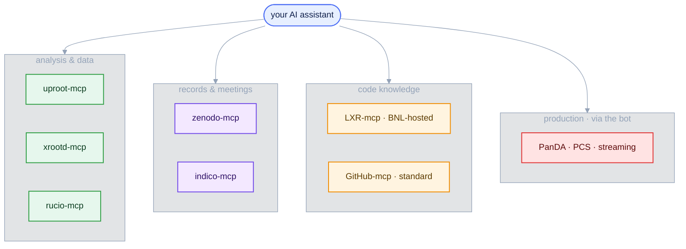
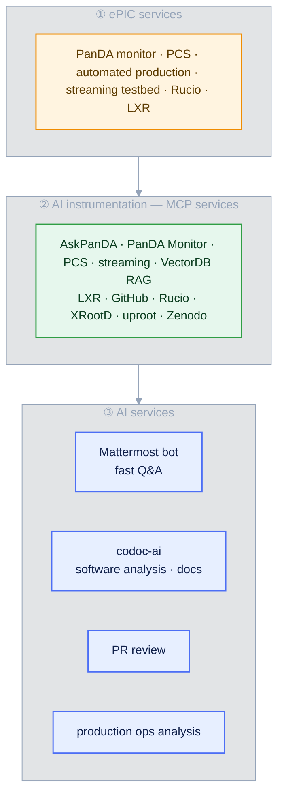

<style>
/* Mermaid: force diagram label text dark so it stays readable on the
   light node fills in BOTH light and dark mode. The Carpentries dark
   theme sets `p`/`li` color and darkens `pre` backgrounds, which would
   otherwise turn mermaid's label text light (invisible on light nodes)
   and the diagram surface dark. We override both, with !important to
   beat the theme rules and mermaid's own inline styles. */
.mermaid { background: transparent !important; }
/* Hide the Workbench "Diagram source code" spoiler under each diagram */
.mermaid-img-wrapper details { display: none !important; }
.mermaid .nodeLabel, .mermaid .edgeLabel, .mermaid .label,
.mermaid .cluster-label, .mermaid text, .mermaid tspan,
.mermaid span, .mermaid p, .mermaid foreignObject div {
  color: #10204a !important;
  fill: #10204a !important;
}
.mermaid .edgeLabel, .mermaid .edgeLabel p, .mermaid .edgeLabel rect {
  background-color: #e2e8f0 !important;
}
/* AI prompts: paste-into-your-assistant blocks. Styled like a normal
   code block (same neutral pre background/border as python etc.), with
   just a small "AI Prompt" tag in the corner. */
pre.ai-prompt, div.sourceCode.ai-prompt {
  border-top: 10px solid #7c3aed;
}
pre.ai-prompt, pre.ai-prompt code {
  white-space: pre-wrap;       /* wrap long prompts onto many lines */
  overflow-wrap: anywhere;
}
pre.ai-prompt::before, div.sourceCode.ai-prompt::before {
  content: "AI Prompt";
  display: block;
  margin-bottom: .5rem;
  font-weight: 600;
  font-size: .78em;
  letter-spacing: .03em;
  text-transform: uppercase;
  color: #7c3aed;
}
</style>

::::::::::::::::::::::::::::::::::::::::::::: questions

- Which MCP servers does EIC/ePIC provide, and which work today?
- How can you use ~100 EPIC MCP tools with zero setup?
- What is the collaboration's AI stack — the bot, corun-ai, LXR — and what does it teach about building harnesses?

:::::::::::::::::::::::::::::::::::::::::::::

::::::::::::::::::::::::::::::::::::::::::::: objectives

- Locate the EIC MCP servers and what each fronts.
- Use the collaboration's Mattermost bot for zero-setup, tool-grounded questions.
- Recognise the layered AI stack: ePIC services → MCP instrumentation → AI services.
- Recognise the production-hardening patterns: tiered tool exposure and fabrication checks.

:::::::::::::::::::::::::::::::::::::::::::::

## One protocol, many tools

MCP is a standard ([Episode 3](03-mcp-servers.md)), so the collaboration exposes each piece of its infrastructure as a small server. The three you used in this lesson are one corner of a much larger, fast-growing stack — built mostly in BNL's NPPS group and presented by Torre Wenaus at the ePIC user-learning WG (June 2026), which this episode distils.

Servers you can connect yourself (as you connected `uproot`: `eic-mcp up`, then `eic-mcp config <client>`):



*The boxes above are links — click a server to open its repository or page.*

::::::::::::::::::::::::::::::::::::::::::::: callout

## Status, honestly

Snapshot from mid-2026 (Torre's June 2026 talk). uproot/xrootd/rucio/zenodo work today and you ran three of them yourself; the LXR MCP server **exists and is central** to the collaboration stack, but is deployed inside the BNL-hosted services (the bot, corun-ai) rather than as a package you run locally; indico is maintained by an individual, not the `eic` org; the production tools (PanDA, PCS) are reachable through the bot. There are already several competing community Rucio (and Indico) MCP implementations — the collaboration expects to converge on whatever becomes standard. See the [eic GitHub organisation](https://github.com/eic) and the [ePIC dev-cloud](https://epic-devcloud.org/doc/) for the current set.

:::::::::::::::::::::::::::::::::::::::::::::

## Analysis and data

::::::::::::::::::::::::::::::::::::::::::::: callout

## uproot-mcp — read ROOT/EDM4eic files  ·  *available · used in this lesson*

{.mcp-logo alt='uproot logo'}

[`eic/uproot-mcp-server`](https://github.com/eic/uproot-mcp-server) reads ROOT/EDM4eic files with
[uproot](https://uproot.readthedocs.io/), returning compact JSON: file structure, branch statistics, histograms, sandboxed NumPy/awkward kernels. The analysis backend from Episodes 3 and 5.

:::::::::::::::::::::::::::::::::::::::::::::

::::::::::::::::::::::::::::::::::::::::::::: callout

## xrootd-mcp — discover files on the data store  ·  *available · used in this lesson*

{.mcp-logo alt='XRootD logo'}

[`eic/xrootd-mcp-server`](https://github.com/eic/xrootd-mcp-server) ([docs](https://eic.github.io/xrootd-mcp-server/)) browses the JLab/dCache XRootD store: list directories, read metadata, search, monitor production campaigns.

:::::::::::::::::::::::::::::::::::::::::::::

::::::::::::::::::::::::::::::::::::::::::::: callout

## rucio-mcp — query the data-management system  ·  *available · used in this lesson*

{.mcp-logo alt='Rucio logo'}

[`eic/rucio-eic-mcp-server`](https://github.com/eic/rucio-eic-mcp-server) exposes [Rucio](https://rucio.cern.ch/) through ~13 tools (dataset discovery, file listing, replicas, rules). The collaboration runs two instances behind its services — JLab (where the data lives) and BNL (production logs) — to be consolidated later. Deliberately **read-only**: other community Rucio MCPs offer write access, which is exactly what isn't wanted here.

:::::::::::::::::::::::::::::::::::::::::::::

## Records and meetings

::::::::::::::::::::::::::::::::::::::::::::: callout

## zenodo-mcp — search the open-data repository  ·  *available*

{.mcp-logo alt='Zenodo logo'}

[`eic/zenodo-mcp-server`](https://github.com/eic/zenodo-mcp-server) queries [Zenodo](https://zenodo.org/) over its REST API: search records, read public datasets and DOIs — ePIC document access.

:::::::::::::::::::::::::::::::::::::::::::::

::::::::::::::::::::::::::::::::::::::::::::: callout

## indico-mcp — search meetings and agendas  ·  *available (community)*

{.mcp-logo alt='Indico logo'}

[`cohm/indico-mcp`](https://github.com/cohm/indico-mcp) searches an [Indico](https://getindico.io/) instance: find events and categories, browse agendas, extract contributions, sessions, and attachments. Maintained by an individual; works with any Indico server.

:::::::::::::::::::::::::::::::::::::::::::::

## Code knowledge: LXR + GitHub

::::::::::::::::::::::::::::::::::::::::::::: callout

## LXR-mcp — the LLM's eyes on the code base  ·  *available (BNL-hosted)*

The EIC runs an [LXR source cross-reference browser](https://eic-code-browser.sdcc.bnl.gov/lxr/source) over the whole software base — 55+ ePIC and related repositories plus dependencies, **re-indexed nightly against the head of every repository** (maintained by Shuwei Ye, BNL NPPS; the same system Torre introduced in STAR in the '90s and ATLAS in the 2000s). Its MCP server gives an assistant structured access to all of it:

* `lxr_ident` — where a symbol (class, function, variable) is defined and referenced, across all repos;
* `lxr_search` — ripgrep-powered regex search over the entire code base;
* `lxr_source` — read source files with line numbers and range filtering;
* `lxr_list` — browse directory contents and repository structure.

Paired with the standard **GitHub MCP** (PRs, commits, issues — the software life cycle), this is what grounds the collaboration's software answers in *current* code rather than the model's training data — the same schema-hallucination cure you saw in Episode 3, applied to source code. Deployed today inside the bot and corun-ai rather than as a locally runnable package.

:::::::::::::::::::::::::::::::::::::::::::::

## Zero setup: the collaboration bot

You spent Episode 3 configuring your own client. The collaboration also runs the opposite trade-off: a **Mattermost bot** (the "PanDA bot", being renamed **DISpatcher**) in an open channel — [chat.epic-eic.org → `pandabot`](https://chat.epic-eic.org/main/channels/pandabot) — that anyone in ePIC can use, in the channel or by DM. All the complexity you just learned about (subscriptions, MCP configuration, server hosting) lives in its back end; users need nothing but the Mattermost account they already have. It is a natural-language command line for the experiment, wired to **roughly 100 MCP tools**:

* **Production:** PanDA diagnostics (AskPanDA, PanDA Monitor — why did my jobs fail?), the Physics Configuration System (which physics samples are in production, and their status), the streaming-workflow testbed;
* **Data:** the same rucio, xrootd, and uproot servers you used in this lesson;
* **Software:** LXR + GitHub (above);
* **Documents:** Zenodo, plus a vector-DB RAG loaded with PanDA and ePIC documentation.

```{.ai-prompt}
(in the pandabot channel)  Summarise the physics tags in the PCS — which processes are covered, and which tags are still draft?
```

::::::::::::::::::::::::::::::::::::::::::::: callout

## Two production-hardening patterns worth stealing

The bot runs a deliberately small, cheap model, and that exposes at scale the failure modes this lesson has warned about — with two responses you can reuse in your own harness:

* **Tiered tool exposure.** LLM tool use degrades past roughly 30–50 tools, and the bot has ~100. So: (1) its system prompt carries only a compact list of every tool; (2) a harness analyses each request and loads full descriptions for just the relevant tools; (3) the bot can still reach everything if it decides it needs to. This is the same context-economy principle as skills' progressive loading in [Episode 4](04-skills.md).
* **The fabrication check.** The bot's biggest problem is making answers up instead of calling a tool. The harness hands the model a **secret token whenever a tool is actually called** and requires the token in the response; no token, and the user is warned the answer was probably fabricated. Verification over confidence ([Episode 1](01-why-genai-for-physics.md)), enforced mechanically. (Telling the bot "you made that up" works too — it apologises and actually calls the tool.)

A third rule follows from the fabrication rate: **don't give an LLM dangerous knobs.** On/off triggers are fine; free parameters that can damage production state are not — those stay behind buttons in web interfaces, fully under user control.

:::::::::::::::::::::::::::::::::::::::::::::

## The AI stack

The bot is the interactive tip of a three-layer stack: instrumented ePIC services at the bottom, an MCP layer over them, AI services on top. Keeping the MCP instrumentation centralized is the point — every new AI service (and your own client) reuses the same tools.



## Long-latency AI: corun-ai and codoc-ai

The bot is fast, transient, and small-brained: it must answer immediately, and its answers recede into chat history. [**`BNLNPPS/corun-ai`**](https://github.com/BNLNPPS/corun-ai) ("Collaborative Runner with AI") is the deliberate complement — a harness where humans configure hybrid AI/programmatic workflows, a scheduler runs them for **minutes** on high-level models, and the results are *preserved and curated* instead of dissipating. It is also an LLM R&D rig: many models (Anthropic, Gemini, open-source via ollama on a remote inference worker), adjustable system/user prompts, side-by-side comparison. In Torre's experience Claude consistently wins these deep-research comparisons.

Its first application is **codoc-ai** at [epic-devcloud.org/doc](https://epic-devcloud.org/doc/): compose an LLM spec (system prompt, model, effort level, MCP tool set, max runtime) with a user prompt, and get a document-generation run grounded in LXR + GitHub. In use today:

* **Onboarding / returning users:** *"I've been away from ePIC software development for 6 months — give me an overview of simu, reco and framework developments so I can get started again"* — run overnight across several models and compared.
* **Specific software questions:** e.g. a study of what limits fastjet performance in EICrecon, injected back into the Mattermost discussion it came from.
* **Documentation generation:** collection pages (e.g. a physics-analyzer's guide to `ReconstructedParticle`), re-runnable against current code — the path to up-to-the-minute, auto-refreshed documentation, *if* experts confirm correctness; hence per-document expert commentary threads.
* **PR review:** any of the ~300 open PRs across the 58 indexed repos can be reviewed with one click, grounded in LXR code knowledge.
* **Snippet assessment** (added by Wouter): judge how out-of-date an ePIC GitHub snippet is against the current code — useful precisely for newcomers learning from old examples.

Anyone can submit runs and comment — accounts are granted by Torre on request.

Where the code lives: the bot is part of [`BNLNPPS/swf-monitor`](https://github.com/BNLNPPS/swf-monitor); corun-ai/codoc-ai are in [`BNLNPPS/corun-ai`](https://github.com/BNLNPPS/corun-ai) (with [`eic/corun-mcp-server`](https://github.com/eic/corun-mcp-server) wrapping the corun REST API as an MCP server, so the bot — or your assistant — can browse documents and submit generation jobs). Everything is open; the ePIC-specific parts are expected to migrate to the `eic` GitHub organisation over time.

::::::::::::::::::::::::::::::::::::::::::::: callout

## Work in progress: argus-ai and wrangle-ai

Between the bot (seconds) and codoc-ai (minutes) sits a mid-latency layer under construction: [**wrangle-ai**](https://github.com/BNLNPPS/wrangle-ai), a persistent agent for extended LLM runs, and **argus-ai**, which points it at *web-based* material — a page plus everything reachable from it (HTML, images, REST JSON). A Chrome-plugin example sends the page you are viewing for analysis **with your own logged-in visibility** — so it can digest authenticated content (a multi-day workshop agenda, all ~600 CHEP abstracts) that no outside LLM service can reach. A near-term physics target: AI-informed validation of ePIC production from Hydra plots.

:::::::::::::::::::::::::::::::::::::::::::::

::::::::::::::::::::::::::::::::::::::::::::: callout

## Hosting, honestly

The services live on the open internet (EC2), because ePIC policy requires user-facing services to be reachable by **all** global collaborators, which today precludes lab perimeters; the plan is lab-resident hosting with InCommon login later. The LLM calls run on personal API accounts because the labs cannot yet provide LLM access for such services. A tunnel (set up with the BNL SDCC facility team) connects the outside services to lab-internal production systems. Torre's own summary: kludged together — but in territory moving this fast, being early is worth the kludge.

:::::::::::::::::::::::::::::::::::::::::::::

## Where this is going

The direction of travel is the one this lesson taught in miniature: centralized, remotely reachable MCP services (HTTP, not local stdio — the transport you used in Episode 3) that plug equally into the collaboration bot, corun-ai, and *your own* assistant; a growing pool of instrumented services; and harness patterns — tiered tool exposure, mechanical verification, curated long-latency runs — hardened in production. From a single free assistant and one tool server up to a collaboration-wide ecosystem, plus a real $\Lambda^0$ measurement you carried out yourself.

::::::::::::::::::::::::::::::::::::::::::::: keypoints

- The EIC exposes its infrastructure through MCP: analysis (uproot), data (xrootd, rucio), records (zenodo, indico), code (LXR + GitHub), and production (PanDA, PCS) — three of which you ran yourself.
- The Mattermost bot (DISpatcher) is the zero-setup path: ~100 MCP tools behind a chat account, no client configuration at all.
- corun-ai/codoc-ai is the long-latency complement — high-level models, preserved and expert-curated outputs, documentation and PR review grounded in nightly-indexed LXR code knowledge.
- Patterns to steal: tiered tool exposure (context economy at scale), the secret-token fabrication check (verification over confidence, enforced), and no dangerous knobs for LLMs.
- This catalogue is a mid-2026 snapshot of fast-moving, deliberately-early infrastructure — check the eic GitHub organisation and the ePIC dev-cloud for the current list.

:::::::::::::::::::::::::::::::::::::::::::::
