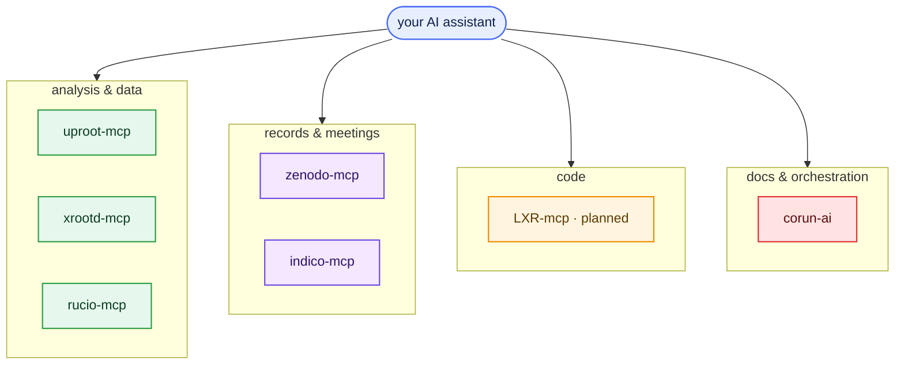

::::::::::::::::::::::::::::::::::::::::::::: questions

- Which MCP servers does the EIC/ePIC collaboration provide?
- What does each one connect an assistant to, and which are ready to use today?
- How do these tools fit into the wider corun-ai / dev-cloud infrastructure?

:::::::::::::::::::::::::::::::::::::::::::::

::::::::::::::::::::::::::::::::::::::::::::: objectives

- Locate the EIC MCP servers and identify what each one fronts.
- Distinguish servers that are available now from those still planned.
- Recognise the corun-ai and ePIC dev-cloud infrastructure these plug into.

:::::::::::::::::::::::::::::::::::::::::::::

## One protocol, many tools

MCP is a standard ([Episode 3](03-mcp-servers.md)), so the collaboration exposes each piece of its
infrastructure as a small server any assistant can use. This page catalogues them. Connect each one
as you connected `uproot`: start it with `eic-mcp up` and point your assistant at its SSE URL.

*The boxes above are links — click a server to open its repository or page.*

::::::::::::::::::::::::::::::::::::::::::::: callout

## Status, honestly

Snapshot from mid-2026. Most servers below are public and working; LXR is planned; indico is
currently maintained by an individual, not the `eic` org. Check the
[eic GitHub organisation](https://github.com/eic) and the
[ePIC dev-cloud](https://epic-devcloud.org/doc/) for the current set.

:::::::::::::::::::::::::::::::::::::::::::::

## Analysis and data

::::::::::::::::::::::::::::::::::::::::::::: callout

## uproot-mcp — read ROOT/EDM4eic files  ·  *available · used in this lesson*

{.mcp-logo alt='uproot logo'}

[`eic/uproot-mcp-server`](https://github.com/eic/uproot-mcp-server) reads ROOT/EDM4eic files with
[uproot](https://uproot.readthedocs.io/) and returns compact JSON: file structure, branch
statistics, histograms, and sandboxed NumPy/awkward kernels. The analysis backend you drove in
Episodes 3 and 5.

:::::::::::::::::::::::::::::::::::::::::::::

::::::::::::::::::::::::::::::::::::::::::::: callout

## xrootd-mcp — discover files on the data store  ·  *available · used in this lesson*

{.mcp-logo alt='XRootD logo'}

[`eic/xrootd-mcp-server`](https://github.com/eic/xrootd-mcp-server)
([docs](https://eic.github.io/xrootd-mcp-server/)) browses the JLab/dCache XRootD store: list
directories, read file metadata, search, and monitor production campaigns — so an assistant can
locate the files an analysis needs.

:::::::::::::::::::::::::::::::::::::::::::::

::::::::::::::::::::::::::::::::::::::::::::: callout

## rucio-mcp — query the data-management system  ·  *available*

{.mcp-logo alt='Rucio logo'}

[`eic/rucio-eic-mcp-server`](https://github.com/eic/rucio-eic-mcp-server) exposes
[Rucio](https://rucio.cern.ch/) — the data-management system the lesson uses to locate datasets —
through ~13 tools (dataset discovery, file listing, quotas, replication rules), with X.509 /
username authentication for the BNL and JLab instances.

:::::::::::::::::::::::::::::::::::::::::::::

## Records and meetings

::::::::::::::::::::::::::::::::::::::::::::: callout

## zenodo-mcp — search the open-data repository  ·  *available*

{.mcp-logo alt='Zenodo logo'}

[`eic/zenodo-mcp-server`](https://github.com/eic/zenodo-mcp-server) queries
[Zenodo](https://zenodo.org/) over its REST API: search records, read public datasets and DOIs,
and (when enabled) manage depositions and uploads — so an assistant can find and cite archived
data and software.

:::::::::::::::::::::::::::::::::::::::::::::

::::::::::::::::::::::::::::::::::::::::::::: callout

## indico-mcp — search meetings and agendas  ·  *available (community)*

{.mcp-logo alt='Indico logo'}

[`cohm/indico-mcp`](https://github.com/cohm/indico-mcp) searches an
[Indico](https://getindico.io/) instance such as the collaboration's meetings: find events and
categories, browse agendas, and extract contributions, sessions, and attachments. Maintained by an
individual contributor; works with any Indico server.

:::::::::::::::::::::::::::::::::::::::::::::

## Code

::::::::::::::::::::::::::::::::::::::::::::: callout

## LXR-mcp — navigate the source code  ·  *planned*

The EIC runs an [LXR source cross-reference browser](https://eic-code-browser.sdcc.bnl.gov/lxr/source)
over the ePIC/EIC software. An `lxr-mcp` server would let an assistant search and navigate that
code — definitions, references, call sites — as you would in an editor. No public standalone repo
exists yet; it is referenced as a tool inside the corun-ai infrastructure below.

:::::::::::::::::::::::::::::::::::::::::::::

## The corun-ai ecosystem

The servers above are individual tools. **corun-ai** is the shared infrastructure that hosts and
orchestrates AI workflows for the collaboration — the BNL project from the workshop's motivation.

* [**`BNLNPPS/corun-ai`**](https://github.com/BNLNPPS/corun-ai) — a collaborative AI-workflow harness:
  humans supply input and tool access, the AI processes asynchronously through defined pipelines,
  results are curated. Deployed at the [ePIC dev-cloud](https://epic-devcloud.org/doc/) to generate
  documentation for the EIC reconstruction software (the *codoc* portal).
* [**`eic/corun-mcp-server`**](https://github.com/eic/corun-mcp-server) — wraps the corun-ai REST API
  as an MCP server: browse documentation, submit prompts, trigger generation jobs, poll results.
* [**`BNLNPPS/swf-monitor`**](https://github.com/BNLNPPS/swf-monitor) — the collaboration bot
  (the "PanDA bot") that relays corun notifications to chat and launches the corun MCP server.

::::::::::::::::::::::::::::::::::::::::::::: callout

## Where this is going

This is the central infrastructure the workshop set out to discuss: shared MCP servers and proxies,
a catalogue of skills, and agent harnesses any collaborator can reuse. You now have the full
picture — from a single free assistant and one tool server up to a collaboration-wide ecosystem —
plus a real Λ⁰ measurement you carried out yourself.

:::::::::::::::::::::::::::::::::::::::::::::

::::::::::::::::::::::::::::::::::::::::::::: keypoints

- The EIC exposes its infrastructure through MCP servers: analysis (uproot), data discovery (xrootd, rucio), records (zenodo), meetings (indico), and code (LXR, planned).
- Two of them — uproot and xrootd — are the servers you used in this lesson.
- Individual servers are the tools; corun-ai and the ePIC dev-cloud are the shared infrastructure that hosts and orchestrates them.
- This catalogue is a snapshot — the set is growing; check the eic GitHub organisation and the ePIC dev-cloud for the current list.

:::::::::::::::::::::::::::::::::::::::::::::
