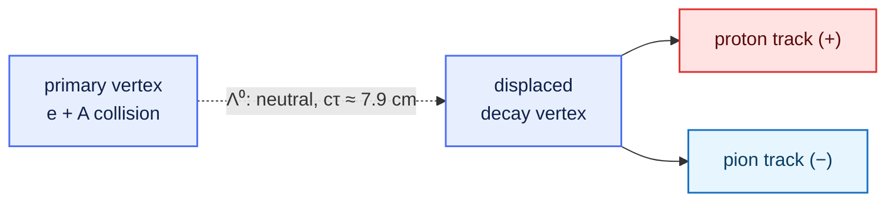

A self-contained reference for the decay reconstructed in this lesson, so the episodes stay
focused on the tooling.

## The Λ⁰ baryon

The Λ⁰ is the lightest strange baryon (quark content **uds**, spin-parity ½⁺). With no lighter
strange state to decay into strongly or electromagnetically, it decays weakly (a
strangeness-changing ΔS = 1 transition). Weak decays are slow, so the Λ⁰ is long-lived on
detector scales (cτ ≈ 7.9 cm), and its dominant mode is two-body and hadronic.

| Quantity | Value (PDG) |
| --- | --- |
| m(Λ⁰) | 1.115683 GeV |
| cτ(Λ⁰) | 7.89 cm |
| BR(Λ⁰ → p π⁻) | 63.9 % |
| m(p) | 0.9382720813 GeV |
| m(π±) | 0.13957061 GeV |
| Q-value | ≈ 37.8 MeV |
| natural width Γ = ħ/τ | ≈ 2.5 × 10⁻⁶ eV |

The charge conjugate **Λ̄ → p̄ π⁺** is reconstructed identically with the antiproton
(PDG `-2212`) and π⁺ (`211`).

## The V0 signature

Travelling ≈ 8 cm before decaying, the Λ⁰ produces a **V0**: two oppositely charged tracks from a
vertex displaced from the primary interaction point. The neutral Λ⁰ leaves no track.



Dedicated analyses use a *V0 finder* to exploit this displacement and suppress background. This
lesson uses a simpler combination of particle identification and invariant mass, enough to expose
a clear peak.

## Observable: invariant mass

The Λ⁰ is not detected directly. For a candidate proton *p*₁ = (E₁, **p**₁) and candidate pion
*p*₂ = (E₂, **p**₂), the pair invariant mass is Lorentz invariant:

```
   E_i = sqrt(|p_i|^2 + m_i^2)            (m_i = assigned proton or pion mass)

   m(p, π) = sqrt( (E_1 + E_2)^2 − |p_1 + p_2|^2 )
```

Forming this for proton–π⁻ pairs across the sample produces:

* a **peak at 1.115683 GeV** from true Λ⁰ decays, and
* a smooth **combinatorial background** from pairs with no common parent.

::::::::::::::::::::::::::::::::::::::::::::: callout

## Width is resolution, not lifetime

The natural width (Γ ≈ 2.5 × 10⁻⁶ eV, from the 7.9 cm lifetime) is negligible next to any
instrumental effect. The observed peak width — a few MeV — measures the **detector momentum and
angular resolution**, not an intrinsic Λ⁰ property.

:::::::::::::::::::::::::::::::::::::::::::::

## Signal extraction

Fit a Gaussian signal on a second-order polynomial background over a window centred on the peak:

```
   f(m) = A · exp( −½ ((m − μ)/σ)^2 )  +  ( c0 + c1 (m − m_Λ) + c2 (m − m_Λ)^2 )
```

The fitted μ should lie within a few MeV of 1.115683 GeV (a residual offset reflects momentum
calibration), σ measures the mass resolution, and the integrated signal is
S = A·√(2π)·σ / (bin width). Build the proton–π⁻ mass spectrum by asking opencode to run the
uproot `execute_kernel_dataset` tool (tree `events`, with the proton and pion branches) across the
dataset's `root://` files, then fit it with the form above. The reference result
(μ ≈ 1.1163 GeV, σ ≈ 2.7 MeV, χ²/ndf ≈ 1.2) is shown below.

{alt='Proton–pion invariant-mass spectrum with Gaussian-plus-polynomial fits showing clear Lambda and anti-Lambda peaks'}
